# Borrador técnico — Cómo se construyó La Última Observación

## Una especificación ejecutable antes que un prototipo

La construcción empezó fijando una fuente de verdad normativa. `AGENTS.md` no es una lista de ideas: define comportamiento observable, contratos públicos, presupuestos, gates y orden de implementación. Ese punto de partida evita que el prototipo derive hacia un WFC volumétrico, un mundo infinito o un render que solo funcione con WebGPU.

## Un flujo autónomo con trazabilidad completa

Cada issue nace de la `dev` remota exacta, se reclama en GitHub Project, se implementa en una rama `codex/issue-*` y termina en una PR no draft contra `dev`. La automatización no fusiona PRs de issue: espera una integración externa, reconcilia la issue y solo entonces selecciona trabajo nuevo. Tests, navegador, Sliplane y memoria forman parte de la entrega, no son comprobaciones opcionales posteriores.

## WP0: de documento a artefacto desplegable

WP0 se dividió en cuatro cortes pequeños. Primero entró la autoridad de producto; después un shell Vite + TypeScript estricto y offline; a continuación, contratos públicos y un worker real con eco numerado; por último, un gate reproducible de formato, tipos, lint, tests, build y CI.

La decisión arquitectónica más importante fue mantener separadas las fronteras desde el principio. El main thread solo conoce `src/contracts/`; el worker valida mensajes en ambos sentidos y transfiere buffers sin copia. Todavía no existe solver, pero ya existe el canal por el que deberá comunicarse.

## Preview continuo sin convertirlo en producción

Sliplane aloja un único servicio preview reutilizable, construido desde el Dockerfile del repositorio y servido por Nginx en el puerto 8080. Cada PR relevante apunta temporalmente el servicio a su rama; el gate de fase lo devuelve a `dev`. La verificación combina evento terminal de despliegue, logs, `/health`, HTTP real y una carga en navegador con consola limpia.

## El gate de fase como frontera de confianza

WP0 solo se promociona cuando #1–#4 están cerradas mediante PRs integradas en `dev`, no hay trabajo de la fase en revisión, CI termina verde, `dev` compila y el preview funciona. La promoción es una PR especial `dev` → `main` con merge commit; después ambas ramas vuelven a compartir el mismo SHA antes de iniciar WP1.

## Próximo capítulo

WP1 sustituirá el eco por el núcleo determinista: bitsets de 64 variantes, PRNG/hash, entropía, propagación FIFO, transacciones, chunks y presupuesto incremental. El objetivo es que el solver sea verificable sin render antes de hacerlo visible en el mundo 3D.

## WP1 empieza por la representación, no por el algoritmo

El primer cambio de WP1 no intenta colapsar una celda. Define cómo se guardarán hasta 64 posibilidades sin crear un `Set` por terreno y otro por feature. Cada dominio usa `lo` y `hi`; las operaciones de set, clear, unión, intersección y copia mutan el objeto propiedad del solver. Un cursor `nextSetBit` permite recorrer candidatos sin construir arrays ni generadores.

La suite cubre todos los tamaños de máscara entre 0 y 64, cada bit individual y las fronteras donde JavaScript cambia de palabra o signo: 31, 32 y 63. Esta base pequeña importa porque propagación y entropía ejecutarán estas funciones miles de veces por segundo; una representación correcta evita que decisiones posteriores tengan que compensar deuda de memoria.

## El determinismo se diseña antes de observar

Con los dominios ya representados, el siguiente paso no fue calcular entropía: fue eliminar cualquier dependencia implícita del reloj y de la aleatoriedad ambiental. Cada subsistema y chunk deriva su propia seed de 32 bits a partir de la seed del mundo. El PRNG avanza únicamente en ticks completos de 100 ms; por eso una ruta renderizada a 30, 60 o 144 FPS produce la misma secuencia.

El hash final sigue una regla distinta a la generación: ordena las celdas fijadas por identidad y resume seed, terreno y feature. Así, el resultado describe el mundo final y no el orden accidental en el que sus celdas entraron en la colección. La versión del hash está etiquetada desde el inicio para que futuras ampliaciones no reinterpreten silenciosamente resultados antiguos.

## Las preferencias solo pesan sobre lo que sigue siendo posible

La entropía llega después de fijar representación y azar explícito. Cada cálculo recorre directamente los bits que sobrevivieron a las restricciones duras. Distancia, vecinos, progresión y ruido pueden multiplicar el peso de esas variantes, pero no existe una ruta que vuelva a insertar una posibilidad eliminada. Esa separación convierte la regla de diseño —la belleza nace de preferencias, la coherencia de restricciones— en una propiedad del código.

Las curvas de distancia se interpolan por tramos y los sesgos de vecinos se acumulan por etiquetas. Todos los factores activos deben ser positivos y finitos; un error de contenido falla antes de consumir el PRNG. La elección ponderada recorre los bits en orden estable y la prioridad de observación usa exactamente carga, continuidad de frontera y entropía normalizada. Si dos celdas siguen empatadas, gana la identidad menor, no el orden accidental de una colección.

El benchmark con 64 variantes mantiene entropía y selección en centésimas de milisegundo de media. Más importante: la seed y el hash canónico no cambian, porque este corte introduce decisiones reproducibles sin tocar todavía commits, rollback o celdas `FIXED`.

## Las restricciones se propagan como una onda finita

La cuarta pieza del solver convierte la compatibilidad de sockets en tablas de bits por dirección. La compilación ocurre una vez: valida referencias, exige reciprocidad y deja para el camino caliente solo máscaras de 64 bits. Cuando una celda pierde posibilidades, la propagación une lo permitido por sus variantes supervivientes, intersecta cada vecina y avanza en orden cardinal fijo.

La cola no es una colección que crece con cada visita. Es un anillo preasignado con una marca por celda: si dos vecinas intentan encolar el mismo trabajo pendiente, la segunda petición se descarta. Tampoco se recalcula entropía cuando una intersección no cambia nada. En un tablero de prueba 64×64 completamente resuelto desde una sola esquina, la onda termina en menos de 1,5 ms en p99.

La contradicción se mantiene separada de la reparación. Si una restricción vacía un dominio o contradice una celda ya fijada, esta capa devuelve el `cellId` y no modifica `FIXED`. La siguiente issue podrá probar candidatos y restaurar snapshots alrededor de esa señal sin esconder backtracking dentro de la propagación.

## El colapso deja de ser una apuesta y se convierte en transacción

La propagación podía detectar una contradicción, pero todavía faltaba una frontera que impidiera mostrar un resultado destinado a desaparecer. #9 introduce esa frontera: cada observación toma un snapshot de la región mutable de radio tres, prueba hasta ocho candidatos ponderados y restaura exactamente el estado antes del siguiente intento. Solo una propagación válida produce commit y evento visual. Las celdas `FIXED` ni siquiera entran en el snapshot, por lo que el rollback no tiene una ruta accidental para reescribir lo ya observado.

El fallback tampoco es un borrado silencioso. Primero intenta tiles puente de la gramática base y después las superficies universales caminables; `quantum_void_debug` permanece como telemetría de último recurso y su aparición sigue siendo fallo de QA. Con ello, la contradicción se convierte en un resultado local recuperable, no en corrupción global ni en un parpadeo visible.

## Los chunks conservan memoria aunque su vista desaparezca

#10 separa por fin mundo lógico y presencia visual. El mapa de 64×64 se divide en chunks de 16×16; cada uno captura su `paletteEpoch` al inicializarse y conserva dominios, fases y bordes aunque su representación 3D se descargue a más de 42 metros. Las restricciones cardinales pueden llegar antes que el vecino: se guardan y se aplican cuando ese chunk nace, evitando costuras incoherentes sin mantener todo el render vivo.

Esta separación prepara el streaming sin convertirlo en regeneración. Alejarse puede liberar geometría, materiales y proxies, pero no cambia qué celdas fueron fijadas ni qué posibilidades sobrevivieron. La frase de diseño también se vuelve una propiedad del almacenamiento: mirar fija el mundo; dejar de verlo no lo deshace.

## El solver entra en el worker con un reloj propio

#11 integra las piezas anteriores en `SolverCore`. El worker consume observación cuantizada a 10 Hz, activa chunks a 18 metros, asegura suelo corporal, actualiza carga y elige como máximo un commit principal cada 90 ms. La distancia se revalida contra la posición real en el instante del commit y nunca se fija una celda más allá de 10,01 metros.

El presupuesto de cuatro milisegundos no cancela el trabajo: la cola y la transacción conservan su estado y continúan en el tick siguiente. Esta decisión hace que bajar calidad visual o variar el framerate no cambie el mundo producido. Cien seeds con una ruta headless común terminaron sin dominios vacíos, sin `quantum_void_debug` y con el mismo hash al repetir la simulación.

## WP2: el núcleo matemático gana cámara, cuerpo y atmósfera

El primer corte de WP2 crea un renderer WebGL2 explícito con cámara a 70°, altura de 1,70 metros, tone mapping ACES, niebla, sombras y presets de calidad. La resolución dinámica recorre 0,7–1,0 del DPR, pero la calidad solo cambia coste visual: no toca ticks, pesos ni decisiones del solver.

Sobre esa escena, #13 añade el controlador en primera persona y una cápsula Rapier real. WASD y flechas comparten entrada; Shift corre, Espacio salta, el ratón controla la mirada y Escape libera Pointer Lock/pausa. Velocidades, pendiente máxima, sensibilidad, inversión Y y cabeceo reducido viven como parámetros explícitos y las pruebas incluyen una cápsula bloqueada por un muro, no solo aritmética aislada.

## Mil transformaciones, una familia visual

#14 completa la fundación 3D agrupando geometría y material por familia. `InstancedMesh` mantiene slots densos, compacta al retirar una instancia y marca `instanceMatrix` para upload; los pools reciclan objetos y los GLB locales se cargan mediante leases con liberación de recursos al perder la última referencia. Un selector estable limita la superposición a 120 proxies.

La escena actual usa esa infraestructura para dibujar 256 detalles de hierba deterministas alrededor del origen. El benchmark prepara 1.000 matrices en un único `InstancedMesh` en 0,3111 ms de media. Es una prueba pequeña pero concreta de que la arquitectura prevista para reducir draw calls ya participa en el build, en vez de existir solo como utilidad futura.

[Ver vídeo de la calibración y el estado actual del juego (WebM, 6 s)](./wp1-wp2-foundations/game-calibration.webm)

La PR acumulativa #66 conserva un commit por issue, de #9 a #14, y apunta a `dev`. El gate final suma 71 tests, build, formato, auditoría sin vulnerabilidades, benchmark y navegador sin errores de aplicación; GitHub la marca `MERGEABLE/CLEAN` con CI verde. Las issues permanecen abiertas hasta que esa PR se integre: la documentación registra un estado en revisión, no una fase ya promocionada.

## WP3 convierte vocabulario artístico en una gramática verificable

El mundo observable necesitaba algo más preciso que una colección de modelos. WP3 formaliza sockets, rotaciones, pesos, tags, seguridad y adaptadores como contenido validable. Meadow A y B comparten encaje pero no apariencia; Agua conserva la cadena Deep–Shallow–Shore–Marsh hasta volver a `OPEN_FLAT`; Bosque y Ruina amplían el lenguaje sin romper el terreno base. El visor offline permite inspeccionar las 36 definiciones autorizadas sin ejecutar una partida completa.

Tormenta quedó fuera de la entrega de jam hasta publicar la candidata y superar su gate de 10.000 seeds. Ya en la fase post-release, Charged Soil, Glass Ground, Scorched Meadow, Crystal, Spikes y Uncertainty Nest amplían la zona exterior con proxies locales y LOD. Scorched Meadow vuelve a `OPEN_FLAT`, los peligros empiezan a 38 m y el pulso de Cristal dura 2,5 s o queda estático con destellos reducidos. La campaña completa conserva 0 vacíos, 0 divergencias y 0 fallbacks.

## WP4 hace visible el acto de decidir

La infraestructura del solver ya podía colapsar, pero el jugador todavía no veía una relación clara entre atención y permanencia. WP4 añade un `WorldState` de 64×64 celdas que sobrevive a la descarga de vistas, una observación muestreada a 10 Hz y una retícula de diez píxeles que se cierra con la carga. Girar la cámara hace decaer la atención; una oclusión la vuelve cero; entrar en contacto fija suelo seguro sin introducir peligro.

Antes del commit, hasta tres proxies low-poly alternan entre 160 y 260 ms. Conforme crece la carga quedan menos alternativas y baja su opacidad. El preset bajo usa dos candidatos y todos comparten pools instanciados con un límite global de 120, de modo que mostrar posibilidades no equivale a cargar tres GLB completos por celda.

El `CollapseDirector` solo acepta el resultado confirmado por el worker y vuelve a validar que la celda esté a 20,01 m o menos. La geometría aparece durante 225–350 ms, el collider entra al 70 % y la onda de borde se emite cuando tile y rotación ya son inmutables. Bordes duplicados se descartan, los arrays transferibles se copian y un unlock cambia el `paletteEpoch` del mundo futuro, nunca el pasado propagado.

## Noventa segundos para demostrar la idea central

El gate técnico termina en un slice reproducible con seed `A91F-42C0`. El reloj empieza en la primera fijación, Agua se vuelve posible para celdas futuras, una muerte devuelve al origen sin borrar el recorrido y el final eleva la cámara: la superposición desaparece, lo observado conserva color y el registro cierra con un haiku local.

[Ver evidencia del vertical slice (WebM, 18 s)](./wp4-observable-world/wp4-vertical-slice.webm)

La evidencia técnica no responde todavía la pregunta más importante: si cinco personas entienden la mecánica sin que nadie se la explique. Por eso #29 conserva un protocolo ciego y sigue en 0/5. No hay enemigo ni packs posteriores hasta obtener 5/5 en aparición y permanencia y una relación reconocible entre mirada y posibilidades. El código puede estar verde; la comprensión del producto aún debe probarse con humanos.

## WP5 ensaya la aventura sin saltarse el gate humano

La siguiente capa ya puede construirse técnicamente sin confundirla con una promoción de producto. Un planificador determinista separa cuatro ángulos al menos 55 grados y coloca Agua, Bosque, Ruina y Tormenta en anillos crecientes. Cada ancla reserva una zona caminable 3×3 y un corredor de dos celdas que nunca se convierte en agua profunda ni pinchos. Cien seeds de prueba conservan alcance, orden y reproducibilidad.

Recoger una Semilla pausa el reloj 1,5 segundos, muestra tres siluetas, incrementa el `paletteEpoch` y abre solo el siguiente pack. Los chunks ya propagados no reciben vocabulario nuevo. La rareza crece de 0,65 a 1,8 con la distancia y el peligro recorre bandas de 0, 3, 7, 11 y 14 por ciento, pero esas curvas solo cambian pesos: nunca reescriben compatibilidades.

Los peligros comparten una frontera de seguridad común. No nacen bajo el cuerpo; los pinchos respetan cuatro metros; el cristal pulsa cada 2,5 segundos; el suelo frágil cede tras 0,8; y el agua profunda conserva una salida transitable. La Incertidumbre solo avanza fuera de la mirada, se detiene al ser observada y necesita 1,2 segundos continuos para volverse estatua y devolver tres segundos una sola vez.

La muerte congela, disuelve y devuelve al monolito con 1,5 segundos de invulnerabilidad. El mundo fijado, las Semillas y el reloj pertenecen a la partida, no al cuerpo, así que sobreviven al respawn. La evidencia automatizada recorre esta secuencia con la seed `A91F-42C0` y conserva las cuatro Semillas al final.

[Ver montaje del preview WP5 (WebM, 17 s)](./wp5-gameplay/wp5-gameplay-preview.webm)

Ese gate se cerró después y WP4/WP5 entraron juntas en `dev` mediante PR #68. A partir de ese punto, el replay acumulativo deja de presentarse como un NO-GO y se convierte en la base reproducible para trabajar la presentación final.

## WP6 convierte sistemas legibles en una experiencia coherente

La presentación no se trató como una capa de barniz. El renderer separa explícitamente lo probable de lo fijado: cian, violeta, wireframe y fresnel antes del commit; oro y blanco durante 225–350 ms; materiales cálidos y rugosos después. La vegetación nace de posiciones deterministas y una sola familia instanciada, mientras la densidad, sombras, bloom y SSAO degradan por preset sin cambiar una sola decisión del solver.

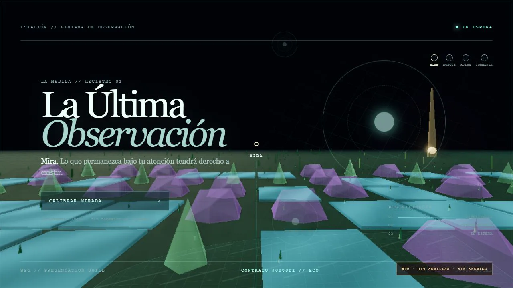

El audio sigue la misma arquitectura. Ningún `AudioContext` existe antes de calibrar la mirada. Tras ese gesto, master, música y efectos se separan en buses; la carga eleva un armónico, cada colapso tiene firma propia, cada Semilla añade un stem permanente y la cuenta atrás cambia de cadencia a 60 y 30 segundos. La Incertidumbre suena fuera del foco y calla en cuanto entra en observación. Un pool de ocho voces impide que el paisaje procedural se convierta en una fuente por celda.

La interfaz deja el centro casi vacío: retícula de diez píxeles, un MIRA que desaparece con el primer colapso, tiempo arriba a la izquierda y cuatro Semillas arriba a la derecha. Escape libera Pointer Lock y abre una pausa que reúne sensibilidad, inversión Y, cabeceo, destellos reducidos, contraste, subtítulos, calidad y tres volúmenes. Mantener R dos segundos reinicia; ocultar la pestaña detiene el reloj.

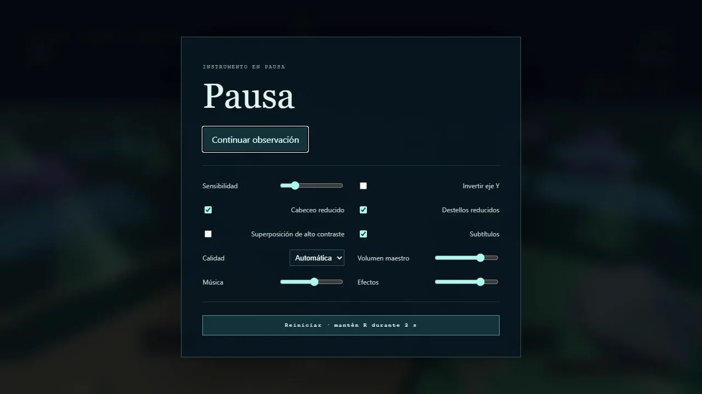

La Medida también pasa a contenido local. Las líneas canónicas de inicio, Agua, muerte, últimos treinta segundos y final viven en `narrative.json`; Bosque, Ruina y Tormenta añaden una intervención breve cada uno. Los subtítulos están activos por defecto y el flujo completo funciona sin voz, de modo que la narración nunca depende de red ni de un proveedor.

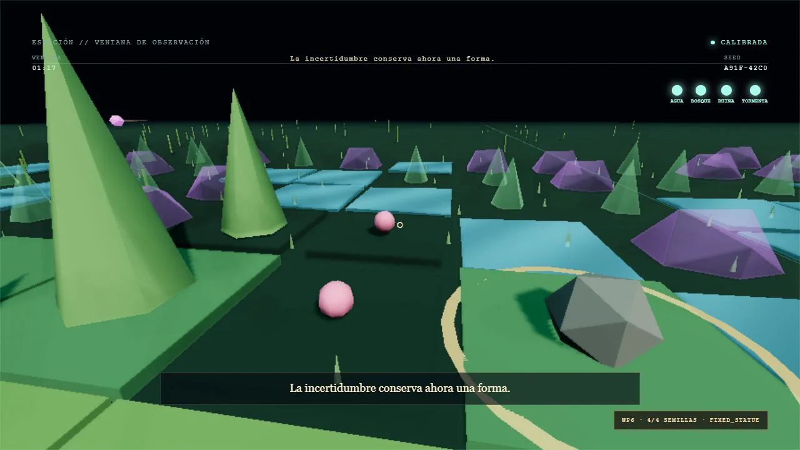

[Ver walkthrough WP6 (WebM VP9, 12 s)](./wp6-presentation/wp6-presentation-walkthrough.webm)

El corte termina con 138 tests, build de producción, auditoría sin vulnerabilidades y un recorrido de navegador sin warnings ni errores. Lo importante no es que haya más efectos, sino que render, sonido, HUD y texto expresan la misma regla: mirar elimina posibilidades y convierte una superposición fría en un lugar material que puede recordarse.

## WP7 convierte la partida en un retrato, no en una puntuación

El final dejó de ser una pantalla activada por el preview. `RunClock` empieza exactamente con el primer colapso, pausa durante menú, pestaña oculta y el instante de una Semilla, pero continúa después de morir. A cero cierra simultáneamente dos fronteras: el main deja de enviar observaciones y también rechaza cualquier commit tardío del worker. Después la cámara asciende ocho segundos sobre lo fijado, mientras lo posible pierde brillo y vuelve a cuadrícula oscura.

El retrato conserva las métricas normativas y las traduce a Jardinero, Cartógrafo, Guardián, Testigo o Impaciente mediante fixtures deterministas, sin puntos ni rango. El mismo replay produce el mismo haiku local de tres líneas. Copiar el resultado incluye título, seed, perfil y poema; reiniciar crea un mundo limpio.

## WP8 intenta romper el mundo antes de empaquetarlo

La depuración también forma parte de la arquitectura. Un replay cuantizado a 10 Hz reconstruye el hash sin renderer; F2 expone cuadrícula, fase, entropía, dominio, radio, oclusión, cola, chunk, epoch, tick y fallbacks; F3 avanza desbloqueos y F4 copia seed, posición, dominios vecinos y los últimos veinte eventos. Ninguna de esas herramientas entra en producción.

La campaña final recorre 10.000 seeds y cinco rutas. Cien ejecuciones levantan el solver completo durante 600 ticks: no aparecen dominios vacíos, commits a más de 10,01 metros, hashes divergentes, fallbacks de juego, `quantum_void_debug` ni Semillas inaccesibles. Los tests de navegador recorren inicio, colapso, Agua, enemigo y final sin red ni errores de consola.

[Ver el recorrido de release completo (WebM)](./wp7-wp8-release/video.webm)

El perfil automatizado mantiene worker y main por debajo de 4 y 12 ms p95, estima 60 FPS y coloca draw calls, triángulos, texturas, descarga y tiempo de arranque dentro de objetivo. Es un gate reproducible, no una afirmación sobre una GPU que no se probó: la matriz distingue Chromium, Firefox y Chrome estable verificados de Edge y hardware integrado pendientes.

La candidata termina como ZIP estático con manifest SHA-256, favicon y assets locales, créditos, procedencia de contenido asistido, privacidad y texto listo para itch.io. Después de cargar sus archivos no hace llamadas de red ni envía datos a modelos. El artefacto final no demuestra que todo mundo posible sea bello; demuestra algo más útil para la jam: que el mundo observado puede terminar, explicarse y volver a reproducirse sin esconder sus límites.

## Conservar una observación sin convertirla en cuenta

La primera expansión post-jam captura el canvas final como PNG sin retrasar el expediente. Seed, perfil y haiku se guardan con la imagen en IndexedDB: cinco entradas como máximo, 5 MiB por entrada, descarga y borrado local. No hay cuenta, nube ni galería pública; conservar un mundo sigue siendo una decisión privada del jugador.

Una segunda opción convierte la fecha UTC en seed compartida sin servidor. El enlace diario y la vuelta a una seed aleatoria estándar viven en la misma portada; el expediente etiqueta fecha y seed. Compartir el día no introduce leaderboard, login ni reloj autoritativo: compartir la seed basta para comparar observaciones.

Jardín de Eco amplía el vocabulario exterior de Tormenta sin inventar una quinta Semilla. Tres suelos `OPEN_FLAT` y tres features con LOD entran solo en chunks futuros tras la cuarta Semilla. La gramática queda en 43/22 variantes, sus proxies pesan menos de 10 KiB y una nueva campaña de 10.000 seeds conserva todos los ceros del gate de release.

La última expansión mantiene una frontera más delicada: el poema local sigue siendo el cierre oficial, pero una publicación puede ofrecer una variante remota después del expediente. La opción no existe en la build estándar. Cuando se configura un proxy HTTPS, un checkbox desmarcado explica la transferencia y habilita una sola petición con perfil y estadísticas redondeadas; no viajan seed, ruta, panorama ni haiku local. Cuatro segundos de timeout, respuesta inválida o desconexión devuelven silenciosamente al poema determinista. La red amplía el lenguaje, nunca decide si la partida terminó.

## Pulido posterior: fallar sin quedar a oscuras

La calibración de mirada escondía un fallo especialmente cruel: si Pointer Lock era rechazado durante el gesto inicial, la interfaz podía retirarse antes de saber si el navegador había concedido el control. Ahora la captura es una transacción observable. Solo se entra en juego al recibir confirmación; ante error, el mundo sigue renderizado, aparece «Reintentar calibración» y el mismo flujo puede completarse sin recargar.

Una regresión posterior reveló que la física también debía respetar esa transacción. El cuerpo ya no acumula gravedad mientras la introducción sigue abierta y cada calibración válida lo devuelve al origen antes de ceder el control. Rapier conserva la respuesta material, pero una envolvente geométrica adicional garantiza que la cápsula no atraviese el plano del suelo ni encuentre una costura entre los segmentos de la cúpula; al empujar contra ella todavía puede deslizarse de lado.

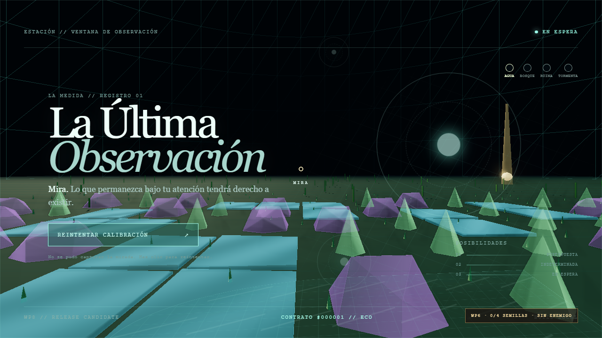

La superposición también aprendió cuándo callarse. Un primer ensayo añadió los pesos normalizados de los candidatos junto a la retícula, pero el panel competía con la mirada y repetía información ya expresada por las siluetas y la carga. El ajuste posterior lo retiró: el centro queda reservado al mundo, el HUD superior solo conserva tiempo y seed, y todos los mensajes comparten una única banda inferior. La barrera esférica de 62 metros conserva la escala visual del paisaje, mientras un anillo de colliders impide abandonar el tablero. Caminar y correr son un 40 % más lentos para dar tiempo a observar antes de atravesar una zona.

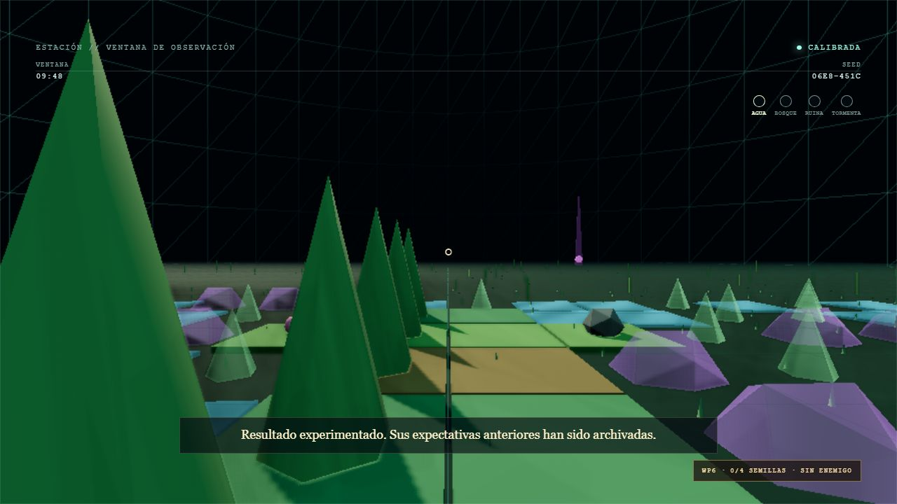

[Ver la recuperación completa de calibración (WebM, 24 s)](./issue-73-gameplay-polish/calibration-recovery.webm)

El cambio sonoro elimina el tono sintético continuo y lo sustituye por una pieza original de casi tres minutos. Primero se generó la letra sobre WFC, superposición y colapso cuántico; después Lyria produjo dos interpretaciones. La toma elegida se validó y se incorporó como MP3 local, de forma que el juego conserva su promesa offline y OpenRouter no participa durante una partida.

## La metáfora cuántica aprende a declarar sus límites

La revisión narrativa posterior no cambia el solver: cambia qué significa para el jugador. QBism ofrece una distinción fértil entre la acción que un agente realiza, la experiencia que recibe y las expectativas que actualiza. El juego toma esa estructura, pero declara dónde termina la referencia científica. La Agencia afirma que una conciencia certificada condensa realidad; la obra nunca confirma esa doctrina ni convierte WFC en física cuántica.

El nuevo canon separa QBism real, ficción institucional y metáfora procedural. Los porcentajes son expectativas de La Medida, las Semillas amplían familias de intervención y una celda fijada entra en el expediente intersubjetivo. Ese marco permite conservar la frase “mirar es construir” sin insinuar que el jugador elige el tile exacto o destruye universos alternativos.

## Cuando una GPU lenta cambia qué significa «automático»

El primer renderer ya tenía resolución dinámica, presets e instancing, pero el juego real seguía pudiendo caer a una presentación de diapositivas. El problema no era el solver del worker: un perfil con Chromium y SwiftShader mostró que el automático escogía calidad media a partir de CPU y RAM, mantenía bloom, esperaba treinta frames antes de reaccionar y dibujaba cada celda fijada con geometría y material propios. A 0,79 FPS, esos treinta frames equivalían a casi cuarenta segundos sin respuesta útil.

La reparación convierte «automático» en una decisión observable y reversible. Un frame de emergencia baja el DPR inmediatamente; si el nivel actual ya agotó su resolución y sigue por encima de 30 ms, desaparecen primero SSAO, después bloom/sombras y finalmente se activa LOD agresivo. El nivel bajo limita el DPR físico, puede bajar a 0,35 y renderiza la escena directamente, sin reservar ni copiar buffers de postprocesado que están desactivados.

La segunda mitad del trabajo reduce coste estructural. Las animaciones de colapso duran ahora 225–350 ms y, al terminar, ya no dejan dos draw calls permanentes: terreno y feature entran en siete lotes instanciados como máximo. Lecturas del mundo, centros, vecindarios y vector de cámara se reutilizan; el contador de celdas fijadas pasa a O(1); la superposición sigue la cadencia normativa de 10 Hz; HUD y retícula no reescriben DOM si el valor no cambió.

## Antes de observar, la Agencia necesita que aceptes su versión

El acceso directo al Condensado ocultaba demasiado contexto. El nuevo arranque
obliga a escoger inglés o español y sitúa el cuerpo de campo en un laboratorio
cerrado. Caminar hasta un botón coral y pulsarlo convierte el tutorial en una
acción física; la pantalla reproduce un briefing corporativo de cincuenta
segundos y después se vuelve portal. Sala, vídeo y portal no consumen reloj: el
tiempo sigue empezando con el primer colapso.

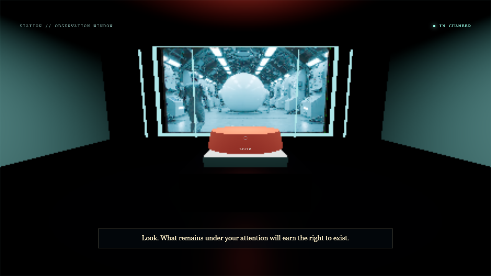

La película usa siete planos silenciosos de Veo 3.1 Lite y captions HTML. La
primera hoja de contactos reveló texto accidental en tres tomas; se rechazaron
y regeneraron antes del montaje final. La narración se compuso por segmentos en
dos idiomas sobre una línea temporal común. Si WebM o códec fallan, siete
láminas locales conservan voz y captions y el portal sigue abriéndose.

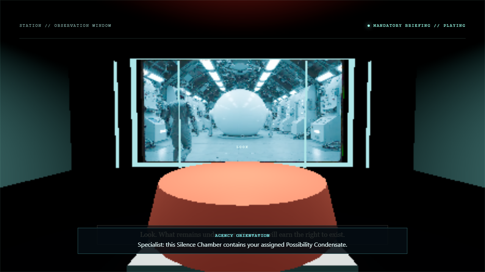

La canción y las veinte voces SAPI desaparecen del build. La Medida dispone
ahora de 44 cues originales por idioma y reproduce como máximo 22 por partida,
con prioridad, contexto, cooldown y estado observable. Harper aporta la voz
inglesa contenida; Kore, dirigida en castellano peninsular, la española. No se
imita a GLaDOS: la referencia queda en la frialdad institucional y la sátira
burocrática, no en un personaje o intérprete existente.

[Ver sala → briefing → portal → primer colapso](./issue-94-bilingual-prologue/room-briefing-portal-collapse.webm)

El briefing tampoco presenta su propaganda como física. «Las máquinas no
concluyen la medición» se atribuye expresamente a la Agencia y se remata como
una doctrina conveniente. Así, Colapsador, cuerpo de campo y La Medida pueden
explicar la ficción sin convertir la conciencia en una causa científica de
colapso. Todo el runtime sigue siendo local: 12,65 MB entre audio y vídeo, cero
credenciales y cero llamadas a modelos durante la partida.

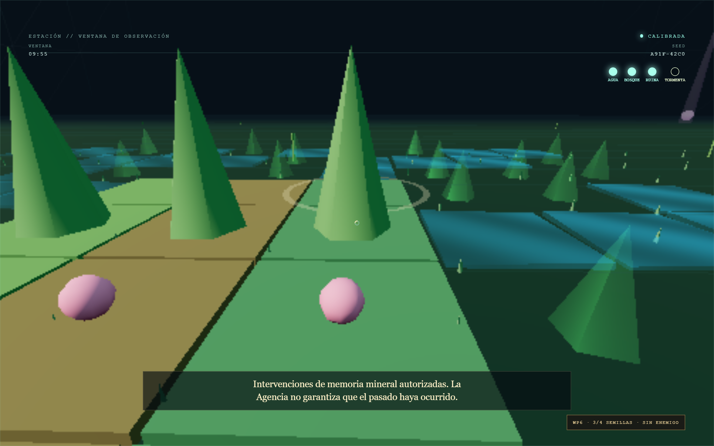

[Ver perfil visual optimizado (WebM, 11,12 s)](./issue-89-performance/optimized-gameplay.webm)

En el mismo escenario SwiftShader con CPU 2×, el perfil documentado subió de 0,79 a 49,39 FPS, 62,5 veces más. Una repetición sin grabación llegó a 53,27 FPS; incluso fingiendo 16 cores y 16 GiB para comenzar en alto, el gobernador reconoció la GPU lenta, degradó hasta bajo y terminó en 56,92 FPS con p95 de 16,8 ms. No es una promesa universal de 60 FPS: es evidencia de que el juego ya puede sacrificar píxeles y efectos antes que movimiento, atención o determinismo.

## Materializar el mundo antes de pisarlo

El primer equilibrio permitía fijar a diez metros, pero en movimiento normal la
carga útil seguía llegando demasiado tarde: el suelo parecía decidirse debajo
del cuerpo. La nueva ventana alcanza veinte metros y carga al doble de velocidad;
el gesto visual también baja a 225–350 ms. El solver conserva sus ticks y su
determinismo, mientras el vecindario y los chunks se adelantan lo justo para que
la onda ocurra en el campo de visión.

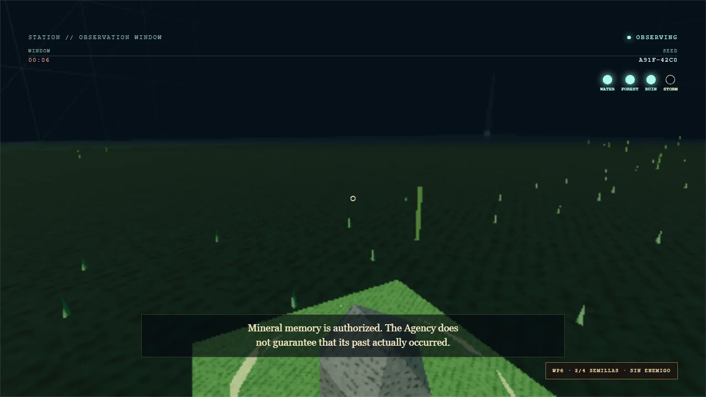

El detalle no llega como una colección de imágenes pesadas. Ocho mapas
procedurales de 64×64 se comparten entre sala, suelo, agua, hojas, roca, flores y
peligros. Son 128 KiB antes de mipmaps y no rompen el batching: centenares de
celdas continúan agrupadas en siete lotes como máximo.

El prólogo también separa dos problemas que antes parecían uno. El WebM era
válido, pero sus planos en movimiento eran blandos y la voz podía pedir permiso
fuera del gesto que autorizó el juego. Ahora el elemento exacto se desbloquea al
calibrar y la prueba observa tiempo de reproducción real. La imagen se recompone
offline a 1080p desde siete láminas locales, con escalado Lanczos y sharpening.

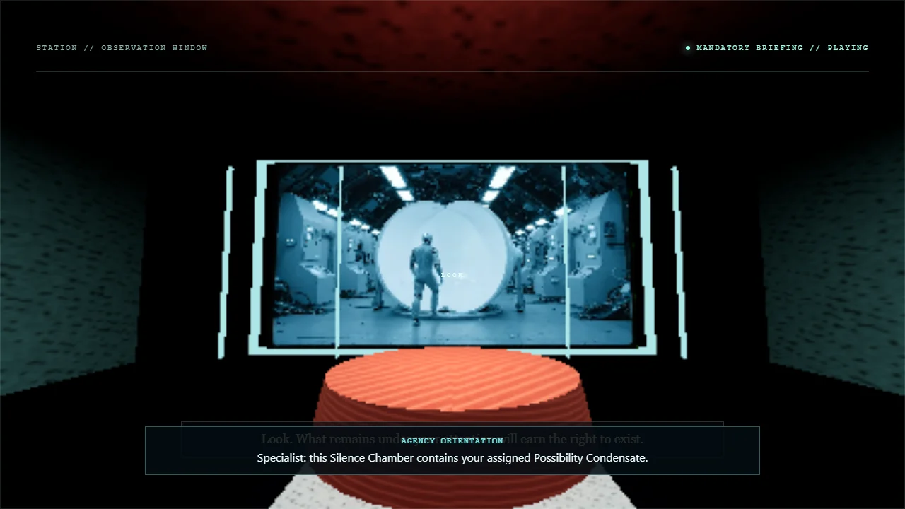

Por último, conservar la observación deja de significar fotografiar la cámara.
La descarga calcula la caja de todas las celdas fijadas y renderiza una vista
ortográfica aislada de 1600×900. La cámara del jugador no se mueve y ni la niebla
ni el FOV pueden recortar el extremo lejano del recorrido.

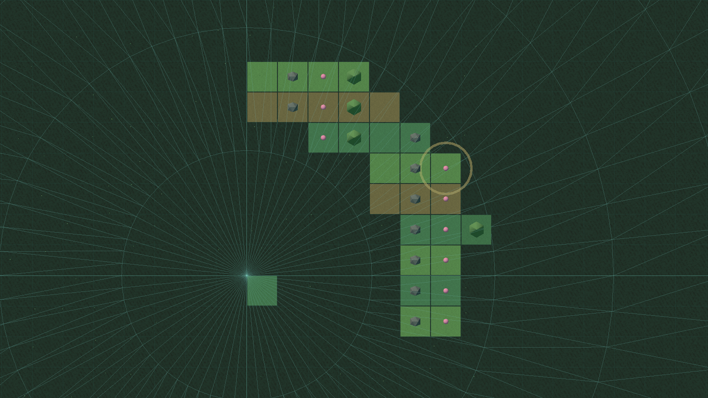

[Ver briefing, colapso texturizado y descarga completa](./issue-96-media-panorama-textures/media-panorama-textures.webm)

## WFC2: la gramática deja de ser decorativa

La segunda versión del colapso elimina una incoherencia decisiva: antes el worker elegía una clase simplificada y el render volvía a decidir árbol, roca o vacío con otro hash. Ahora cada chunk nace de `COMPILED_GRAMMAR`, conserva dominios separados de terreno y feature y publica al main thread el tile, la rotación y las familias todavía legales. La superposición puede alternar agua, vegetación, roca, estructura, peligro y vacío porque observa el dominio real.

El mismo cambio cierra los huecos aislados. Después de una observación, una celda visible rodeada por cuatro resultados fijados recibe una consecuencia forzada; esa consecuencia no busca nuevos huecos, por lo que la onda repara el defecto sin rellenar automáticamente recintos enteros.

La bomba de consciencia convierte el riesgo en una decisión espacial. Es roja, negra y espinosa, aparece desde el vocabulario base con una curva del uno al diez por ciento y solo explota por contacto. Cada detonación revoca quince metros de celdas ya observadas: la cobertura baja, los objetos desaparecen y queda una cicatriz oscura caminable que no puede colapsarse otra vez. Dos cuerpos de campo regresan al origen; el tercero cierra el expediente y ofrece el mismo retrato final que el agotamiento del reloj.

Entre el briefing y el portal, Dr Alice Boole enuncia por fin la operación completa: observar la mayor superficie en diez minutos, recuperar Agua, Bosque, Ruina y Tormenta en orden y conservar tres vidas. El retrato es original, local y sin texto horneado; el nombre y los subtítulos siguen siendo HTML accesible. Harper y Kore reproducen directiva y derrota desde cuatro MP3 locales con hashes, loudness, transcripción, coste y procedencia registrados.

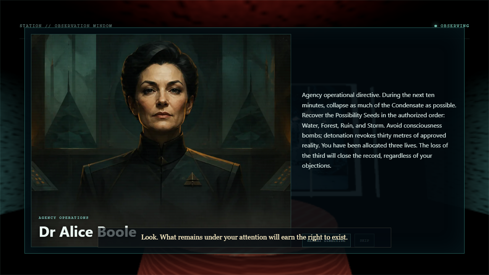

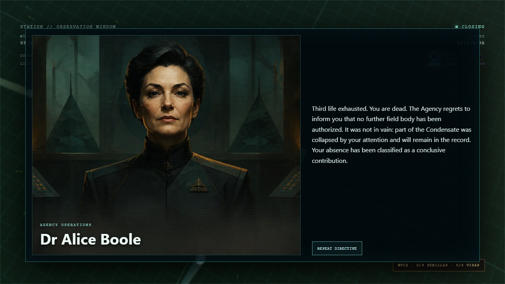

[Ver el flujo de fractura y final por vidas](./wfc2-integral/wfc2-lives-final.webm)

## Cuando un bioma deja de ser ruido y empieza a recordar a sus vecinos

El vocabulario de WFC2 ya incluía agua y bosque, pero dos detalles anulaban su intención: los pesos blandos se perdían al compilar la gramática y cada celda se ponderaba sin leer los tags ya fijados a su alrededor. Conservar `distanceCurve` y `neighborBias` permite que la elección siga siendo probabilística sin parecer dispersión uniforme.

El agua desbloqueada parte ahora con más presencia y consulta el tamaño de su componente conectado. Crece con fuerza por debajo de ocho celdas, continúa con moderación hasta dieciséis y, desde diecisiete, prefiere orilla, marisma y cierre. A partir de veinticuatro, la salida hacia terreno abierto pesa mucho más. Vecinos opuestos favorecen ríos estrechos; esquinas y tres lados favorecen lagos que se cierran. Son preferencias, nunca incompatibilidades capaces de bloquear el solver.

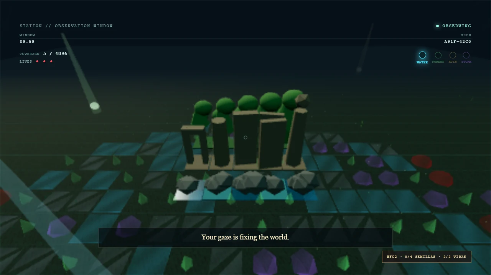

Los árboles usan la misma lógica social: un vecino duplica como mínimo su probabilidad relativa, mientras una densidad superior al 60 % inclina el siguiente resultado hacia claros, setas o vacío. La escala acompaña a esa gramática. Jóvenes y viejos alcanzan alturas forestales; rocas y ruinas ocupan casi toda la celda y bloquean con colliders acordes. Cinco geometrías compuestas por definición se eligen con seed y celda, pero terminan en lotes instanciados para no cambiar silueta por draw calls.

## La explosión necesita existir antes que la muerte

El contacto con una bomba ya no salta directamente a la disolución del cuerpo. Una fase pública `DETONATING` conserva la cámara durante 0,7 segundos: el núcleo rojo con pinchos negros queda rodeado por semiesferas y anillos amarillos, verdes y naranjas. Solo al terminar esa lectura visual se fractura la región y se consume exactamente una vida. El modo de movimiento reducido sustituye la expansión rápida por una única cúpula y un anillo que se desvanecen.

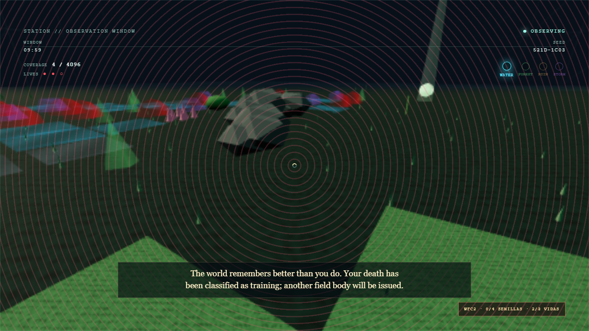

[Ver detonación, fractura y cierre por tres vidas](./issue-105-visual-biomes-prologue/bomb-detonation-and-terminal.webm)

El final anticipado también corrige un fallo auditivo: la línea terminal cancela cualquier voz anterior mediante `AudioDirector` y el cierre por vidas no vuelve a reproducir la voz genérica de final. El haiku, el perfil y el texto permanecen, pero solo habla una fuente.

## La pantalla sigue siendo pantalla; el portal ocupa la sala

Alice Boole ya no aparece como una gran capa HTML delante de la escena. Su WebP local se aplica al mismo material de la pantalla 3D que mostró el vídeo, con scanlines y tratamiento cromático compartido. Los subtítulos y el control de omisión permanecen como interfaz accesible inferior, y la antigua acción de repetir la directiva desaparece.

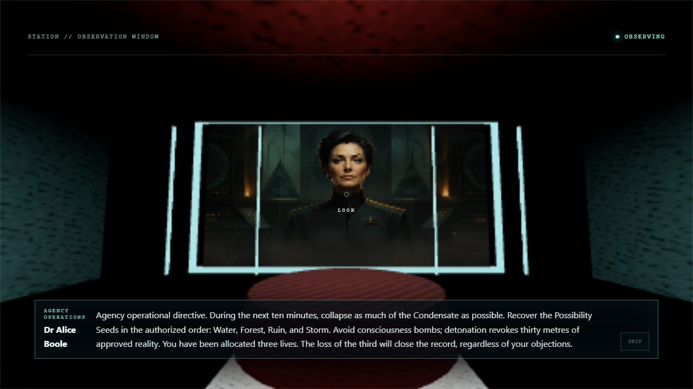

Al terminar, el botón coral queda apagado y no vuelve a aceptar interacción. La pared no se abre: delante de la pantalla nace una esfera blanca emisiva de 1,1 m de radio y `RUN` solo comienza cuando el cuerpo entra en su volumen.

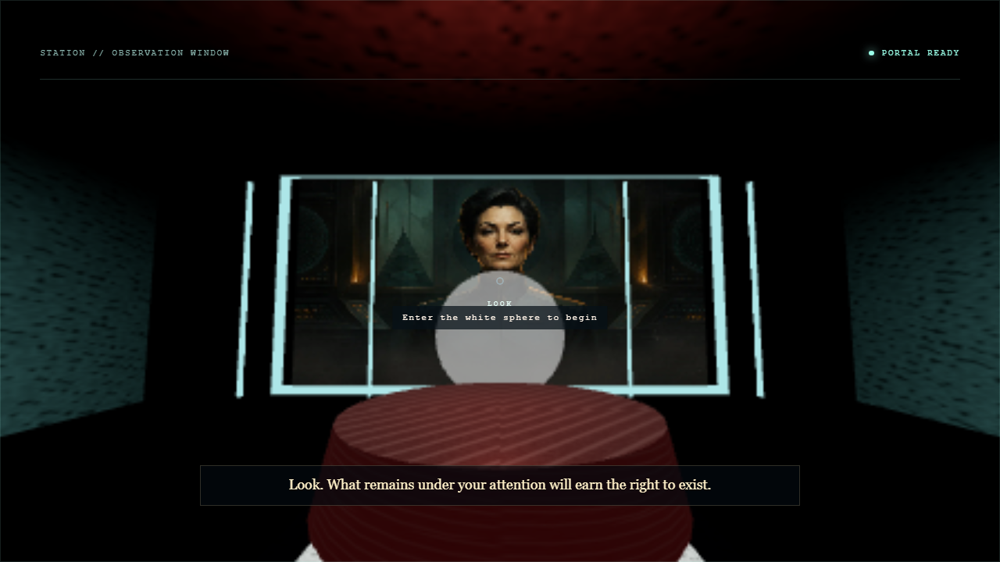

[Ver prólogo, esfera y entrada al mundo](./issue-105-visual-biomes-prologue/prologue-portal-run.webm)

## Cuando sobrevivir también cierra un expediente

El final original interpretaba cualquier partida sin jerarquizarla. Ese gesto
permanece: la nueva variante no asigna puntos ni degrada los demás retratos.
Solo reconoce un caso operativo muy concreto. Al agotarse los diez minutos del
modo estándar deben seguir vivas 1536 celdas, quedar al menos un cuerpo de campo
y constar Agua, Bosque, Ruina y Tormenta. Una explosión importa hasta el último
instante porque las cicatrices `FRACTURED` ya no cuentan como observación fija.

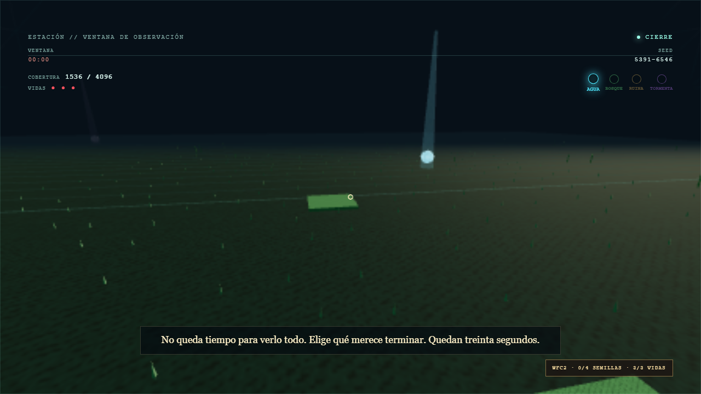

La clasificación se calcula una vez sobre el estado final y se serializa en el
resultado. Después de los ocho segundos de ascensión, la Agencia ocupa la
pantalla con cuatro planos de archivo, condensados e instrumental absurdamente
solemne. No sustituye el haiku ni el panorama: añade una despedida burocrática
antes de devolver el control al mismo resultado copiable.

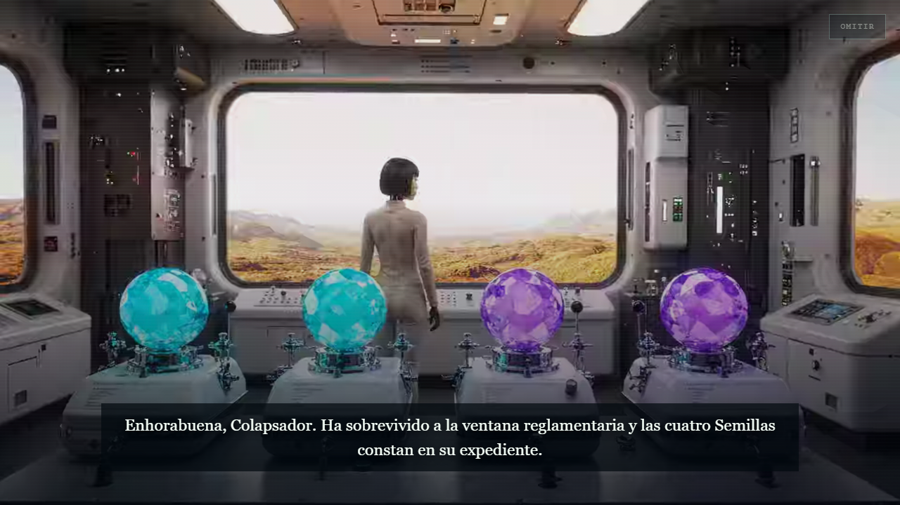

Vídeo, Harper, Kore y cuatro imágenes de reserva viven dentro de la build. Los
subtítulos marcan la línea temporal y siguen funcionando si falla cualquiera de
los medios; la omisión se habilita a los tres segundos. Los manifiestos cuentan
también los intentos rechazados: texto accidental en dos planos, dos mezclas EN
fuera del objetivo y un coste acumulado de proyecto de 4,573846 USD.

[Ver cierre completo en español](./issue-112-mission-complete/mission-complete-es.webm)

## Regresar del Condensado también necesita un lugar

La primera versión del cierre especial ocupaba toda la ventana con el vídeo y
lo mantenía alineado a un cronómetro de treinta y dos segundos. Esa doble
autoridad podía adelantar el `currentTime` o abandonar la pieza antes de que el
navegador hubiera completado ambos medios. El regreso ahora es diegético: al
terminar el ascenso aparece una sala de reintegración 3D, más oscura y
tecnológica que la Cámara inicial, y el expediente se reproduce en la pantalla
física que espera frente al cuerpo recuperado.

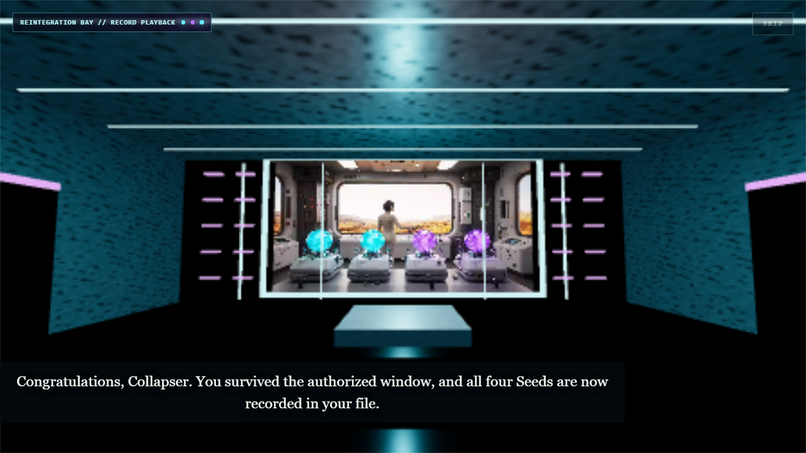

Vídeo y voz conservan sus propios relojes. La fase solo concluye cuando ambos
han emitido `ended`; los fallos cambian a las láminas WebP y mantienen captions,
con un watchdog final para que un medio averiado tampoco bloquee el resultado.
La Medida adopta la misma disciplina: una voz activa no se corta, no se mezcla
y no deja una cola que comente tarde una acción ya pasada. El disparo ocupado se
descarta y puede volver a intentarse únicamente si el acontecimiento sucede de
nuevo. Finalmente, una celda `FRACTURED` desaparece de los proxies en el mismo
evento de explosión: una cicatriz terminal ya no finge que todavía puede ser
observada.

[Ver la reproducción completa en la sala de retorno](./issue-117-final-chamber-audio-fractures/return-chamber-playback.webm)

El replay automatizado prueba el borde exacto sin hacerse pasar por una persona.
La pregunta de balance queda abierta y explícita: hace falta una partida humana
real de diez minutos para saber si 1536 es exigente pero alcanzable. Hasta
entonces, #112 permanece NO-GO y ningún resultado humano se inventa para cerrar
la historia.

## El recuerdo no puede fotografiar la sala equivocada

La sala de reintegración introdujo una transición correcta y una fotografía
incorrecta. Para reproducir el expediente, el cierre oculta el mundo y coloca
una nueva pantalla 3D en su lugar. El panorama se generaba después de ese
cambio: en vez del planeta, el render cenital encontraba únicamente un pequeño
rectángulo tecnológico en mitad del vacío.

El cierre conserva ahora un negativo del mundo justo antes de entrar en la
sala. Es una cámara ortográfica aislada, sin niebla y sin dependencia de la
cámara de juego. Cuando llegan los resultados, otro canvas utiliza ese negativo
para construir un recuerdo 1600 × 900: el paisaje sigue ocupando el fondo, el
wordmark facetado se aísla de la propia carátula suministrada y una franja
resume la proporción fijada, las Semillas y las muertes. La URL de itch.io y la
seed convierten el archivo en algo compartible sin subir un solo byte.

El mismo repaso corrigió dos disonancias de lectura. El caption del expediente
estaba centrado dentro de su caja, pero la caja seguía anclada a la izquierda;
ahora toda la franja se centra a la altura original. Y la directiva inglesa
muestra «thirteen metres», lo que el jugador escucha, aunque el radio mecánico
permanezca en quince y no se regenere la voz.

[Ver el cierre y la tarjeta descargada](./issue-120-final-panorama-card/mission-finale-and-card.webm)
