# Borrador técnico — Cómo se construyó La Última Observación

## Una especificación ejecutable antes que un prototipo

La construcción empezó fijando una fuente de verdad normativa. `AGENTS.md` no es una lista de ideas: define comportamiento observable, contratos públicos, presupuestos, gates y orden de implementación. Ese punto de partida evita que el prototipo derive hacia un WFC volumétrico, un mundo infinito o un render que solo funcione con WebGPU.

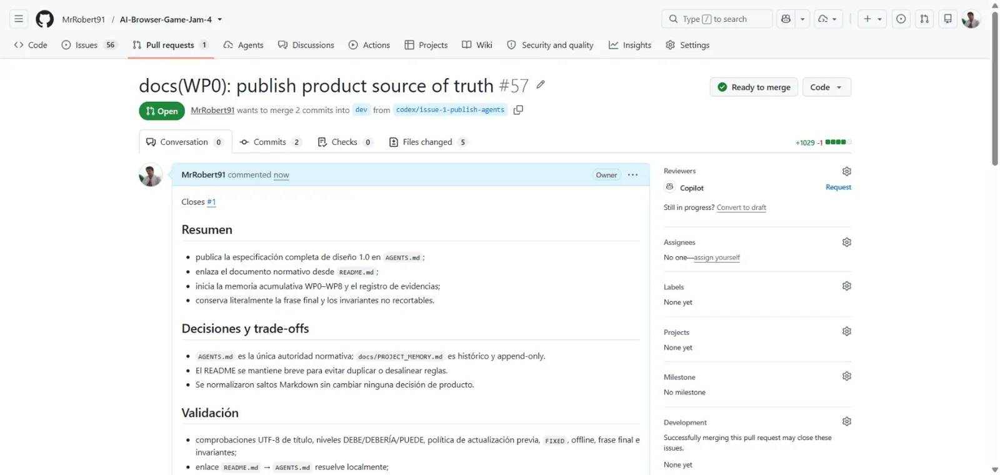

## Un flujo autónomo con trazabilidad completa

Cada issue nace de la `dev` remota exacta, se reclama en GitHub Project, se implementa en una rama `codex/issue-*` y termina en una PR no draft contra `dev`. La automatización no fusiona PRs de issue: espera una integración externa, reconcilia la issue y solo entonces selecciona trabajo nuevo. Tests, navegador, Sliplane y memoria forman parte de la entrega, no son comprobaciones opcionales posteriores.

## WP0: de documento a artefacto desplegable

WP0 se dividió en cuatro cortes pequeños. Primero entró la autoridad de producto; después un shell Vite + TypeScript estricto y offline; a continuación, contratos públicos y un worker real con eco numerado; por último, un gate reproducible de formato, tipos, lint, tests, build y CI.

La decisión arquitectónica más importante fue mantener separadas las fronteras desde el principio. El main thread solo conoce `src/contracts/`; el worker valida mensajes en ambos sentidos y transfiere buffers sin copia. Todavía no existe solver, pero ya existe el canal por el que deberá comunicarse.

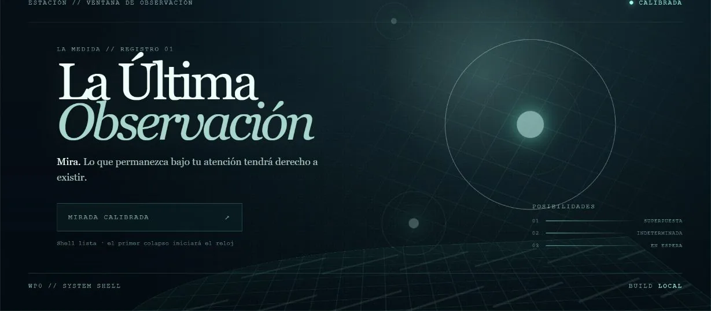

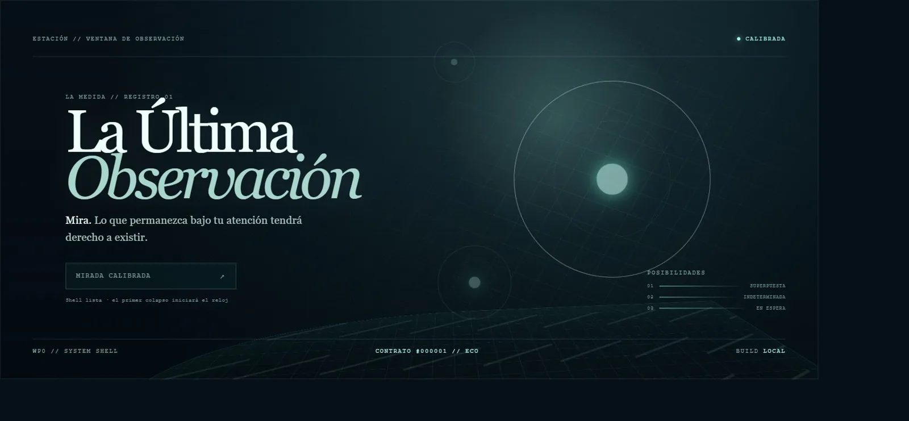

## Preview continuo sin convertirlo en producción

Sliplane aloja un único servicio preview reutilizable, construido desde el Dockerfile del repositorio y servido por Nginx en el puerto 8080. Cada PR relevante apunta temporalmente el servicio a su rama; el gate de fase lo devuelve a `dev`. La verificación combina evento terminal de despliegue, logs, `/health`, HTTP real y una carga en navegador con consola limpia.

## El gate de fase como frontera de confianza

WP0 solo se promociona cuando #1–#4 están cerradas mediante PRs integradas en `dev`, no hay trabajo de la fase en revisión, CI termina verde, `dev` compila y el preview funciona. La promoción es una PR especial `dev` → `main` con merge commit; después ambas ramas vuelven a compartir el mismo SHA antes de iniciar WP1.

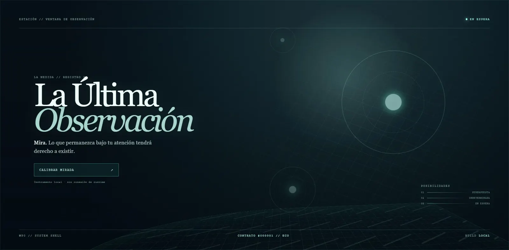

## Próximo capítulo

WP1 sustituirá el eco por el núcleo determinista: bitsets de 64 variantes, PRNG/hash, entropía, propagación FIFO, transacciones, chunks y presupuesto incremental. El objetivo es que el solver sea verificable sin render antes de hacerlo visible en el mundo 3D.

## WP1 empieza por la representación, no por el algoritmo

El primer cambio de WP1 no intenta colapsar una celda. Define cómo se guardarán hasta 64 posibilidades sin crear un `Set` por terreno y otro por feature. Cada dominio usa `lo` y `hi`; las operaciones de set, clear, unión, intersección y copia mutan el objeto propiedad del solver. Un cursor `nextSetBit` permite recorrer candidatos sin construir arrays ni generadores.

La suite cubre todos los tamaños de máscara entre 0 y 64, cada bit individual y las fronteras donde JavaScript cambia de palabra o signo: 31, 32 y 63. Esta base pequeña importa porque propagación y entropía ejecutarán estas funciones miles de veces por segundo; una representación correcta evita que decisiones posteriores tengan que compensar deuda de memoria.

## El determinismo se diseña antes de observar

Con los dominios ya representados, el siguiente paso no fue calcular entropía: fue eliminar cualquier dependencia implícita del reloj y de la aleatoriedad ambiental. Cada subsistema y chunk deriva su propia seed de 32 bits a partir de la seed del mundo. El PRNG avanza únicamente en ticks completos de 100 ms; por eso una ruta renderizada a 30, 60 o 144 FPS produce la misma secuencia.

El hash final sigue una regla distinta a la generación: ordena las celdas fijadas por identidad y resume seed, terreno y feature. Así, el resultado describe el mundo final y no el orden accidental en el que sus celdas entraron en la colección. La versión del hash está etiquetada desde el inicio para que futuras ampliaciones no reinterpreten silenciosamente resultados antiguos.

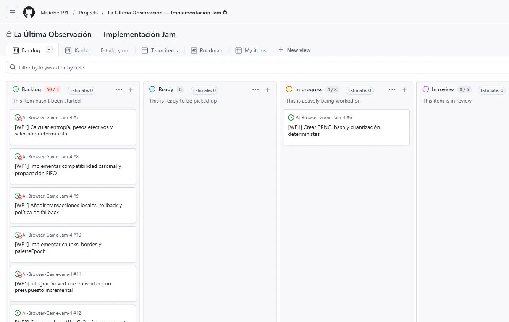

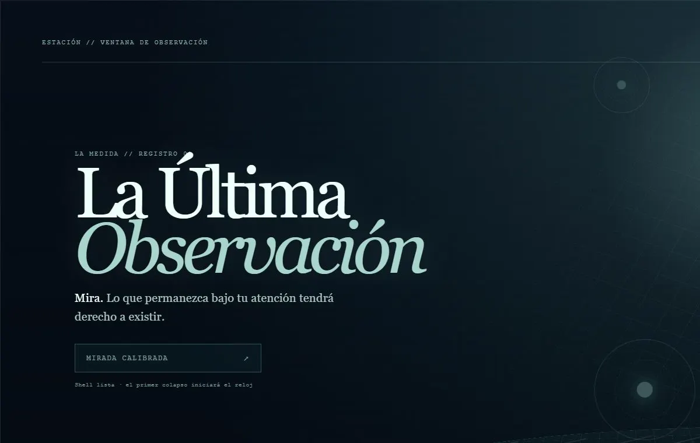

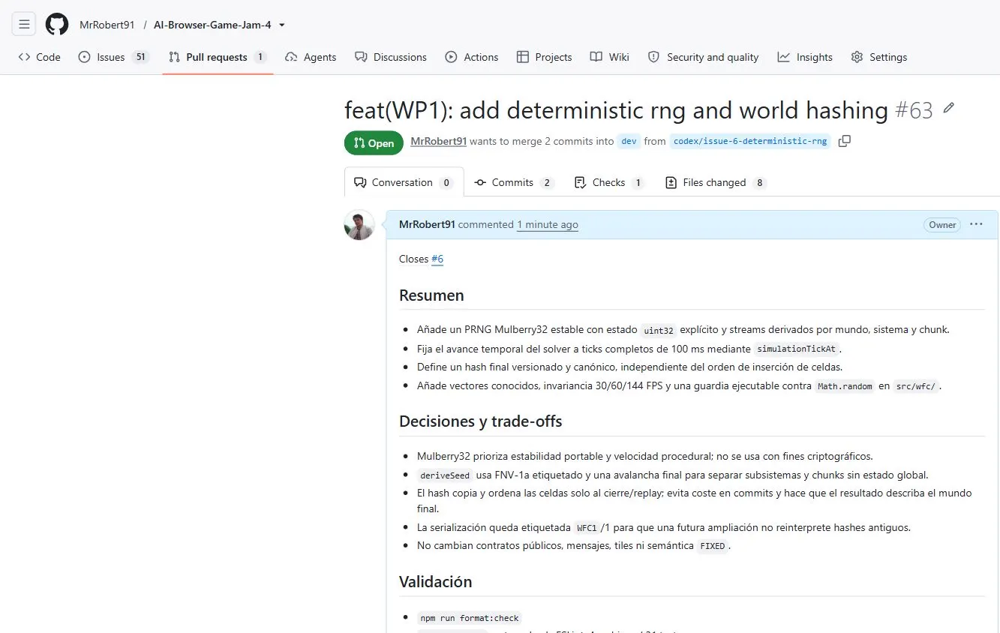

## Las preferencias solo pesan sobre lo que sigue siendo posible

La entropía llega después de fijar representación y azar explícito. Cada cálculo recorre directamente los bits que sobrevivieron a las restricciones duras. Distancia, vecinos, progresión y ruido pueden multiplicar el peso de esas variantes, pero no existe una ruta que vuelva a insertar una posibilidad eliminada. Esa separación convierte la regla de diseño —la belleza nace de preferencias, la coherencia de restricciones— en una propiedad del código.

Las curvas de distancia se interpolan por tramos y los sesgos de vecinos se acumulan por etiquetas. Todos los factores activos deben ser positivos y finitos; un error de contenido falla antes de consumir el PRNG. La elección ponderada recorre los bits en orden estable y la prioridad de observación usa exactamente carga, continuidad de frontera y entropía normalizada. Si dos celdas siguen empatadas, gana la identidad menor, no el orden accidental de una colección.

El benchmark con 64 variantes mantiene entropía y selección en centésimas de milisegundo de media. Más importante: la seed y el hash canónico no cambian, porque este corte introduce decisiones reproducibles sin tocar todavía commits, rollback o celdas `FIXED`.

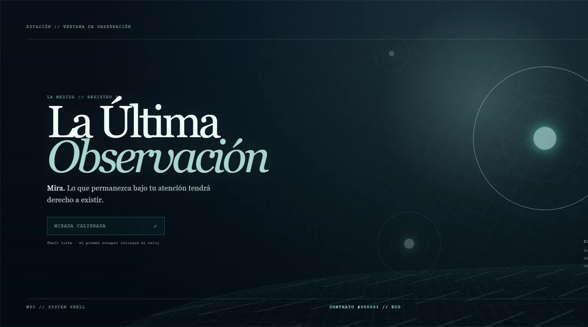

## Las restricciones se propagan como una onda finita

La cuarta pieza del solver convierte la compatibilidad de sockets en tablas de bits por dirección. La compilación ocurre una vez: valida referencias, exige reciprocidad y deja para el camino caliente solo máscaras de 64 bits. Cuando una celda pierde posibilidades, la propagación une lo permitido por sus variantes supervivientes, intersecta cada vecina y avanza en orden cardinal fijo.

La cola no es una colección que crece con cada visita. Es un anillo preasignado con una marca por celda: si dos vecinas intentan encolar el mismo trabajo pendiente, la segunda petición se descarta. Tampoco se recalcula entropía cuando una intersección no cambia nada. En un tablero de prueba 64×64 completamente resuelto desde una sola esquina, la onda termina en menos de 1,5 ms en p99.

La contradicción se mantiene separada de la reparación. Si una restricción vacía un dominio o contradice una celda ya fijada, esta capa devuelve el `cellId` y no modifica `FIXED`. La siguiente issue podrá probar candidatos y restaurar snapshots alrededor de esa señal sin esconder backtracking dentro de la propagación.

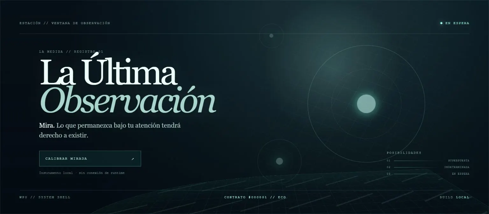

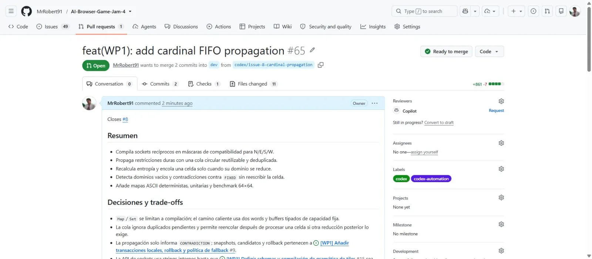

## El colapso deja de ser una apuesta y se convierte en transacción

La propagación podía detectar una contradicción, pero todavía faltaba una frontera que impidiera mostrar un resultado destinado a desaparecer. #9 introduce esa frontera: cada observación toma un snapshot de la región mutable de radio tres, prueba hasta ocho candidatos ponderados y restaura exactamente el estado antes del siguiente intento. Solo una propagación válida produce commit y evento visual. Las celdas `FIXED` ni siquiera entran en el snapshot, por lo que el rollback no tiene una ruta accidental para reescribir lo ya observado.

El fallback tampoco es un borrado silencioso. Primero intenta tiles puente de la gramática base y después las superficies universales caminables; `quantum_void_debug` permanece como telemetría de último recurso y su aparición sigue siendo fallo de QA. Con ello, la contradicción se convierte en un resultado local recuperable, no en corrupción global ni en un parpadeo visible.

## Los chunks conservan memoria aunque su vista desaparezca

#10 separa por fin mundo lógico y presencia visual. El mapa de 64×64 se divide en chunks de 16×16; cada uno captura su `paletteEpoch` al inicializarse y conserva dominios, fases y bordes aunque su representación 3D se descargue a más de 42 metros. Las restricciones cardinales pueden llegar antes que el vecino: se guardan y se aplican cuando ese chunk nace, evitando costuras incoherentes sin mantener todo el render vivo.

Esta separación prepara el streaming sin convertirlo en regeneración. Alejarse puede liberar geometría, materiales y proxies, pero no cambia qué celdas fueron fijadas ni qué posibilidades sobrevivieron. La frase de diseño también se vuelve una propiedad del almacenamiento: mirar fija el mundo; dejar de verlo no lo deshace.

## El solver entra en el worker con un reloj propio

#11 integra las piezas anteriores en `SolverCore`. El worker consume observación cuantizada a 10 Hz, activa chunks a 18 metros, asegura suelo corporal, actualiza carga y elige como máximo un commit principal cada 90 ms. La distancia se revalida contra la posición real en el instante del commit y nunca se fija una celda más allá de 10,01 metros.

El presupuesto de cuatro milisegundos no cancela el trabajo: la cola y la transacción conservan su estado y continúan en el tick siguiente. Esta decisión hace que bajar calidad visual o variar el framerate no cambie el mundo producido. Cien seeds con una ruta headless común terminaron sin dominios vacíos, sin `quantum_void_debug` y con el mismo hash al repetir la simulación.

## WP2: el núcleo matemático gana cámara, cuerpo y atmósfera

El primer corte de WP2 crea un renderer WebGL2 explícito con cámara a 70°, altura de 1,70 metros, tone mapping ACES, niebla, sombras y presets de calidad. La resolución dinámica recorre 0,7–1,0 del DPR, pero la calidad solo cambia coste visual: no toca ticks, pesos ni decisiones del solver.

Sobre esa escena, #13 añade el controlador en primera persona y una cápsula Rapier real. WASD y flechas comparten entrada; Shift corre, Espacio salta, el ratón controla la mirada y Escape libera Pointer Lock/pausa. Velocidades, pendiente máxima, sensibilidad, inversión Y y cabeceo reducido viven como parámetros explícitos y las pruebas incluyen una cápsula bloqueada por un muro, no solo aritmética aislada.

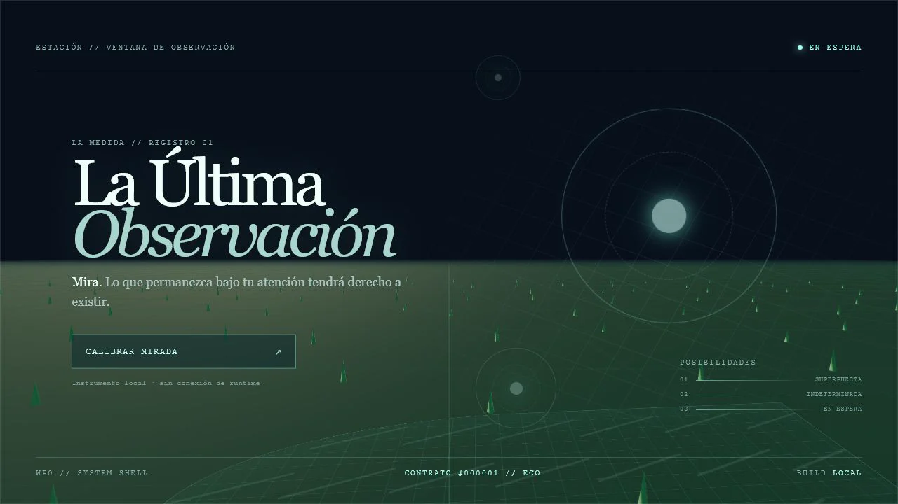

## Mil transformaciones, una familia visual

#14 completa la fundación 3D agrupando geometría y material por familia. `InstancedMesh` mantiene slots densos, compacta al retirar una instancia y marca `instanceMatrix` para upload; los pools reciclan objetos y los GLB locales se cargan mediante leases con liberación de recursos al perder la última referencia. Un selector estable limita la superposición a 120 proxies.

La escena actual usa esa infraestructura para dibujar 256 detalles de hierba deterministas alrededor del origen. El benchmark prepara 1.000 matrices en un único `InstancedMesh` en 0,3111 ms de media. Es una prueba pequeña pero concreta de que la arquitectura prevista para reducir draw calls ya participa en el build, en vez de existir solo como utilidad futura.

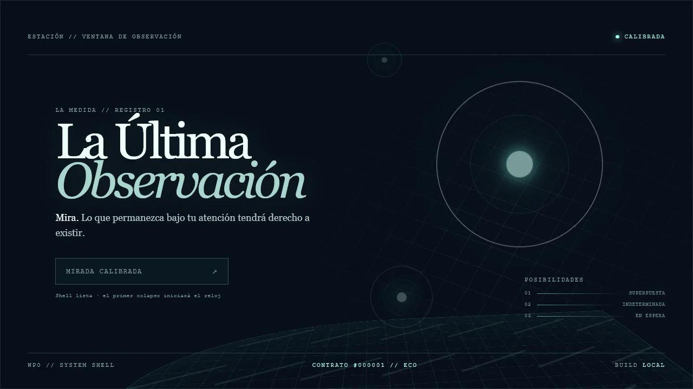

[Ver vídeo de la calibración y el estado actual del juego (WebM, 6 s)](./wp1-wp2-foundations/game-calibration.webm)

La PR acumulativa #66 conserva un commit por issue, de #9 a #14, y apunta a `dev`. El gate final suma 71 tests, build, formato, auditoría sin vulnerabilidades, benchmark y navegador sin errores de aplicación; GitHub la marca `MERGEABLE/CLEAN` con CI verde. Las issues permanecen abiertas hasta que esa PR se integre: la documentación registra un estado en revisión, no una fase ya promocionada.

## WP3 convierte vocabulario artístico en una gramática verificable

El mundo observable necesitaba algo más preciso que una colección de modelos. WP3 formaliza sockets, rotaciones, pesos, tags, seguridad y adaptadores como contenido validable. Meadow A y B comparten encaje pero no apariencia; Agua conserva la cadena Deep–Shallow–Shore–Marsh hasta volver a `OPEN_FLAT`; Bosque y Ruina amplían el lenguaje sin romper el terreno base. El visor offline permite inspeccionar las 36 definiciones autorizadas sin ejecutar una partida completa.

Tormenta queda fuera de esta entrega de forma deliberada. Su issue depende del gate de 10.000 seeds de la release candidate; activarla antes convertiría una dependencia explícita en deuda invisible. La gramática que sí entra en `dev` pasa reciprocidad, dos salidas, seguridad, assets locales y el límite de 64 variantes por capa.

## WP4 hace visible el acto de decidir

La infraestructura del solver ya podía colapsar, pero el jugador todavía no veía una relación clara entre atención y permanencia. WP4 añade un `WorldState` de 64×64 celdas que sobrevive a la descarga de vistas, una observación muestreada a 10 Hz y una retícula de diez píxeles que se cierra con la carga. Girar la cámara hace decaer la atención; una oclusión la vuelve cero; entrar en contacto fija suelo seguro sin introducir peligro.

Antes del commit, hasta tres proxies low-poly alternan entre 160 y 260 ms. Conforme crece la carga quedan menos alternativas y baja su opacidad. El preset bajo usa dos candidatos y todos comparten pools instanciados con un límite global de 120, de modo que mostrar posibilidades no equivale a cargar tres GLB completos por celda.

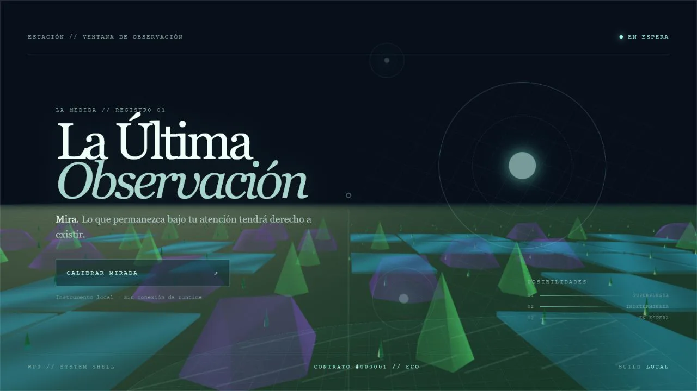

El `CollapseDirector` solo acepta el resultado confirmado por el worker y vuelve a validar que la celda esté a 10,01 m o menos. La geometría aparece durante 450–700 ms, el collider entra al 70 % y la onda de borde se emite cuando tile y rotación ya son inmutables. Bordes duplicados se descartan, los arrays transferibles se copian y un unlock cambia el `paletteEpoch` del mundo futuro, nunca el pasado propagado.

## Noventa segundos para demostrar la idea central

El gate técnico termina en un slice reproducible con seed `A91F-42C0`. El reloj empieza en la primera fijación, Agua se vuelve posible para celdas futuras, una muerte devuelve al origen sin borrar el recorrido y el final eleva la cámara: la superposición desaparece, lo observado conserva color y el registro cierra con un haiku local.

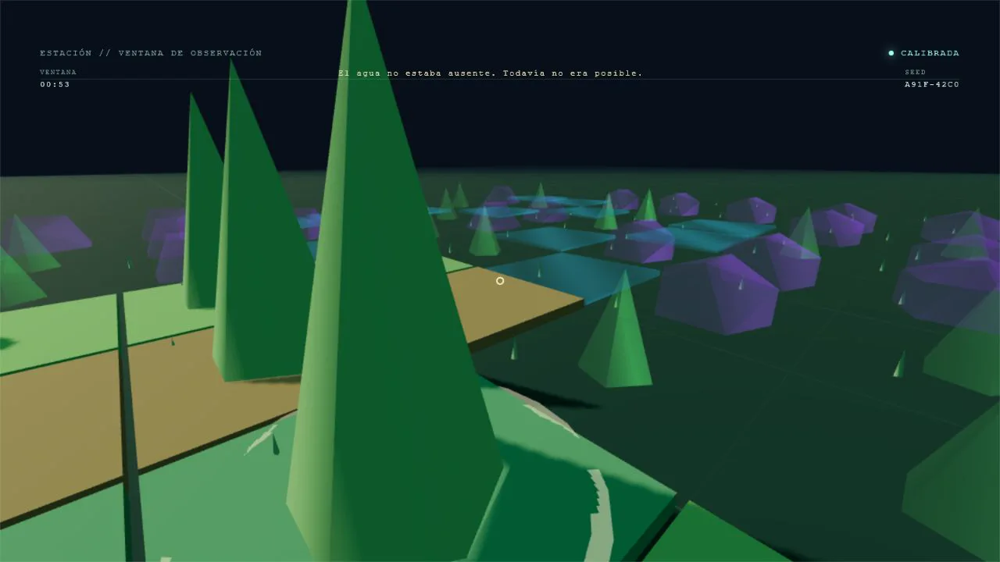

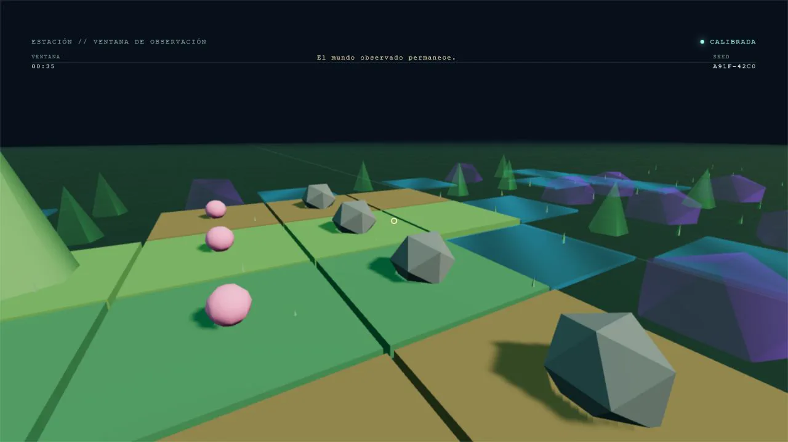

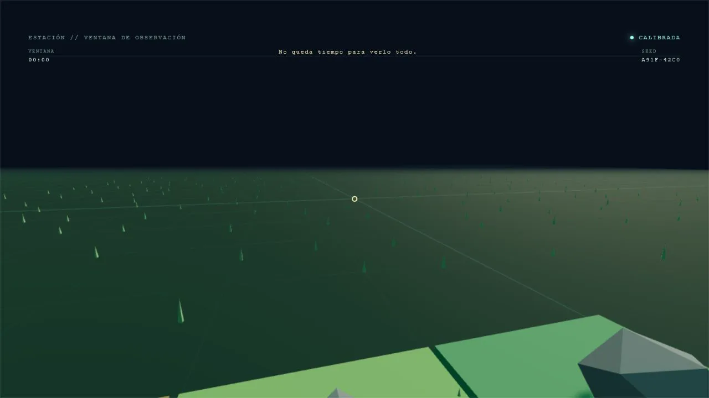

[Ver evidencia del vertical slice (WebM, 18 s)](./wp4-observable-world/wp4-vertical-slice.webm)

La evidencia técnica no responde todavía la pregunta más importante: si cinco personas entienden la mecánica sin que nadie se la explique. Por eso #29 conserva un protocolo ciego y sigue en 0/5. No hay enemigo ni packs posteriores hasta obtener 5/5 en aparición y permanencia y una relación reconocible entre mirada y posibilidades. El código puede estar verde; la comprensión del producto aún debe probarse con humanos.
