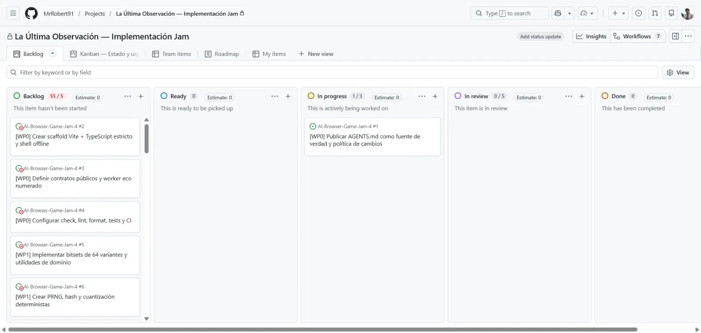
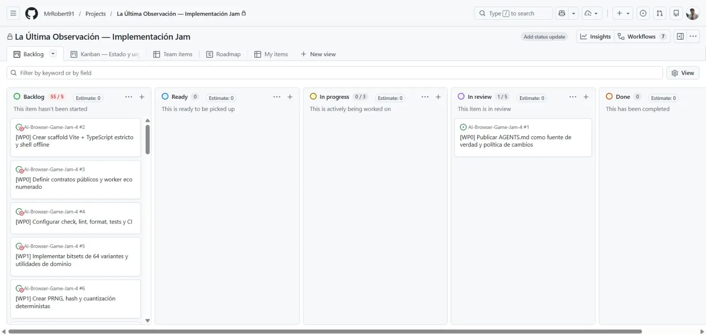

# Evidencia — Issue #1

## Estado inicial

El Project mostraba la issue #1 en **In progress**, sin PRs abiertas, y la issue #2 todavía bloqueada. `dev` y `main` apuntaban a `7190c837dcb1f4b4566273a785ea2948130e0d40`.

## Validación

- Documento normativo: comprobaciones de contenido y codificación UTF-8.
- README: enlace relativo a `AGENTS.md` verificado.
- Aplicación local y vídeo: N/A; la issue es exclusivamente documental y el repositorio todavía no contiene una shell web.
- Sliplane: proyecto preview `La Ultima Observacion Preview` (`project_3o4wtis2vnhk`) creado; servicio y URL N/A hasta que #2 genere un artefacto desplegable.

## Estado final

La PR #57 quedó abierta, no draft, con base `dev`, head `codex/issue-1-publish-agents`, estado `MERGEABLE/CLEAN` y sin checks configurados.

La issue conserva `status:in-review` y el Project la muestra en **In review**. La PR de issue no se fusionó.

