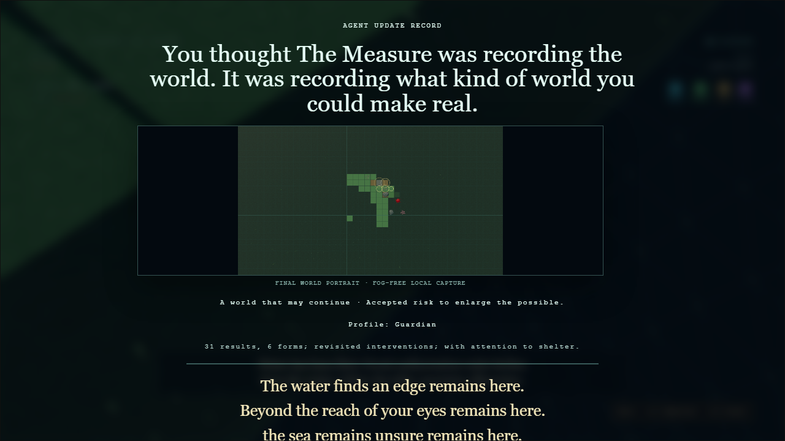

# Issue #115 — gameplay safety, narration, frontier and final portrait

## Delivered behavior

- Blocking feature colliders remain non-physical while the player is inside the 2.5 m body-safety radius of a newly collapsed cell. The same collider activates after the player clears the cell, so rocks, trees and ruins remain solid without trapping the player.
- Consciousness-bomb fracture radius is 15 m instead of 30 m. Protected anchors, corridors and terminal `FRACTURED` behavior are unchanged.
- The worker publishes domains for the complete visible observation disc. Rendering prioritizes unresolved cells adjacent to `FIXED` cells and can display up to 384 shared instanced proxies, covering the entire 20 m disc.
- La Medida has 16 new bilingual events: five minutes remaining, post-Seed hints, four rising bomb-risk notices, four low-coverage prompts and three rock-jump remarks. Context cadence is sampled every 20 s with an 18 s general cooldown and a 6 s reactive cooldown.
- The eight-second ascent disables scene fog and interpolates to a world-bounds-derived top-down perspective pose. The same fog-free portrait is rendered to a 1600 × 900 local PNG and displayed directly in results.

## Local media

- 32 new MP3 clips (16 EN + 16 ES) were generated once through OpenRouter and packaged under `public/assets/audio/voice/`.
- English retains `microsoft/mai-voice-2` / `en-US-Harper:MAI-Voice-2`; Spanish retains `google/gemini-3.1-flash-tts-preview` / `Kore`.
- All 127 audio assets pass the loudness gate. The 32 new clips pass automatic transcription at 83.3–100% similarity (minimum accepted: 72%).
- Confirmed manifest TTS total: $0.403132. This package added $0.153290 of TTS; focused transcription QA cost $0.007023. Total issue-specific API spend: $0.160313, below the authorized $3 limit.
- Runtime remains offline; no generation or transcription endpoint is referenced by gameplay code.

## Evidence

The capture is produced by the canonical offline English replay in Chromium when `PLAYWRIGHT_EVIDENCE=1`. The same replay also passed in Firefox.

## Validation

- `npm run check`: 51 files / 220 tests passed; TypeScript and ESLint clean.
- `npm run build`: Vite production build passed.
- `npm run validate:tiles`: 7 passed.
- `npm run validate:assets`: 2 passed.
- `npm run test:sim`: 100 seeds × 600 ticks, zero empty domains, out-of-radius commits, deterministic mismatches, fallbacks, debug voids or unreachable Seeds.
- `npm audit --audit-level=high`: 0 vulnerabilities.
- Chromium `release-journey.spec.ts`: 11/11 passed, including offline runtime, final PNG/results, mission video fallbacks and three-life ending.
- Canonical final replay passed in Chromium and Firefox with `data-ending-fog="off"`, fitted ending height and visible blob-backed panorama preview.
