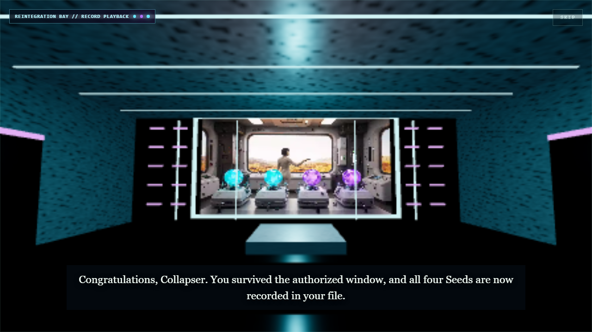
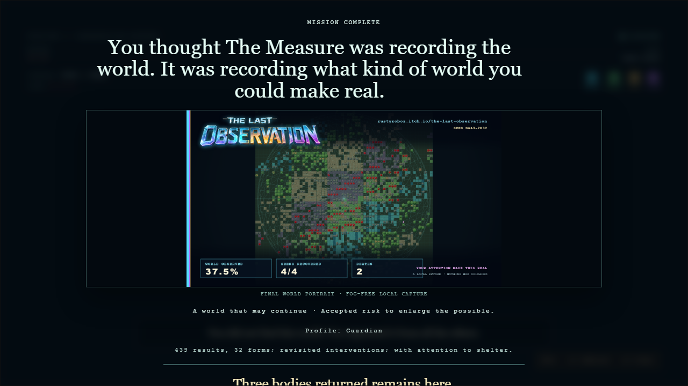
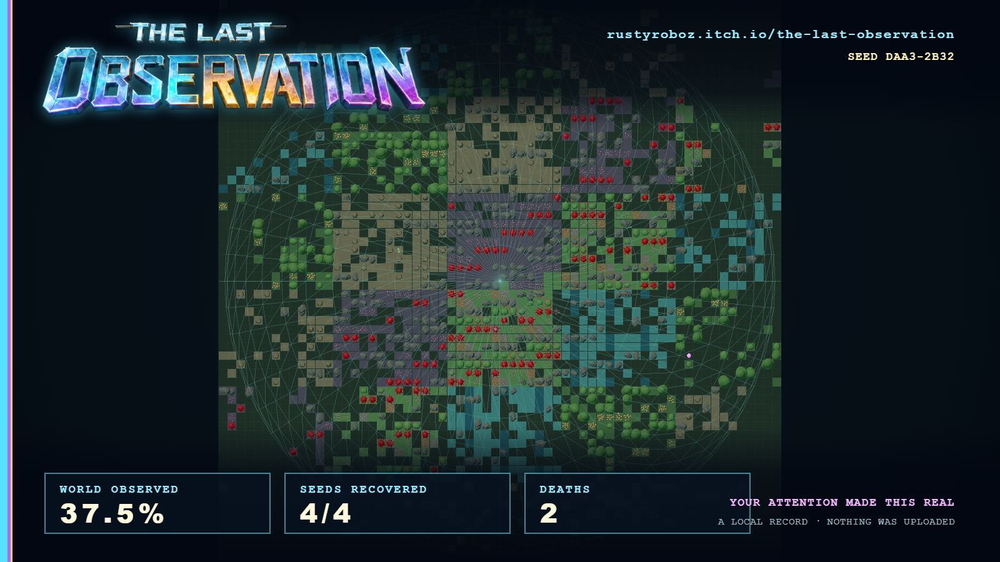

# Issue #120 — subtítulos y tarjeta final del mundo

## Comportamiento entregado

- Los captions del vídeo final conservan su altura inferior y ahora se centran
  respecto al viewport completo mediante el layout de la propia cuadrícula.
- La directiva inglesa muestra `thirteen metres`, igual que la voz percibida,
  sin regenerar ni modificar el audio local. La mecánica sigue usando 15 m.
- El mundo se renderiza y congela al empezar el cierre, antes de que
  `MISSION_VIDEO` oculte el paisaje y cree la sala de reintegración. La captura
  descargable ya no puede fotografiar la pantalla de esa sala como un cuadrado
  aislado.
- La captura vuelve a usar una cámara ortográfica independiente, encuadrada por
  las celdas visibles al terminar y sin niebla.
- El PNG 1600 × 900 se compone íntegramente en el navegador: mapa a sangre,
  wordmark facetado aislado de la carátula suministrada, URL de itch.io, seed y
  resumen real de porcentaje observado, Semillas y muertes. No se carga
  ninguna fuente ni recurso remoto.

## Evidencia reproducible







[Ver la secuencia final, resultados y descarga](./mission-finale-and-card.webm)

El replay de evidencia materializa de forma determinista el umbral exacto de
1536 celdas mediante los mismos lotes instanciados de terreno y features que la
partida. Incluye los cinco vocabularios y mantiene el mundo visible durante la
captura. Fuera de `replay=mission-complete&evidence=1`, la tarjeta usa
exclusivamente las celdas que esa partida haya generado realmente.

## Validación

```powershell
npm.cmd run check
npm.cmd run format:check
npm.cmd run build
npm.cmd run validate:tiles
npm.cmd run validate:assets
npm.cmd run test:sim
npm.cmd audit --audit-level=high
$env:PLAYWRIGHT_PORT='4180'
$env:PLAYWRIGHT_EVIDENCE='1'
npm.cmd exec playwright -- test tests/e2e/release-journey.spec.ts --project=chromium-16x10 --grep "qualified EN replay"
```

La E2E verifica por geometría el centro horizontal del caption, el texto
`thirteen metres`, el instante de captura anterior a la sala, las métricas
37,5 % / 4 de 4 / 2 y las dimensiones PNG 1600 × 900. Validación final: 51
archivos / 226 tests, gramática 7/7, assets 2/2, simulación de 100 seeds y
20.008 colapsos con todos los contadores de fallo a cero, build y auditoría sin
vulnerabilidades. La matriz E2E terminó 20/21 rutas aplicables en verde y una
omitida por diseño; el único borde de un frame observado en Firefox ES se
repitió después con la tolerancia temporal explícita y pasó.
