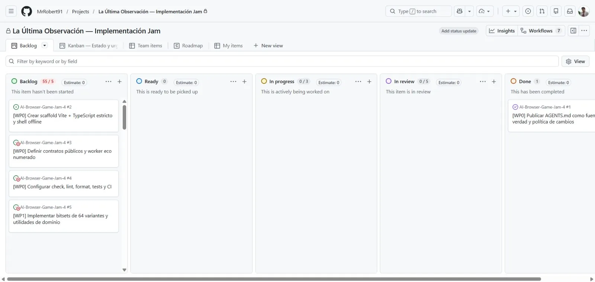
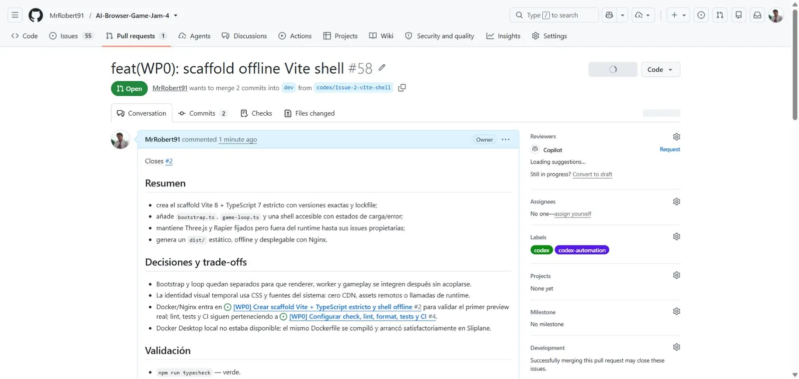
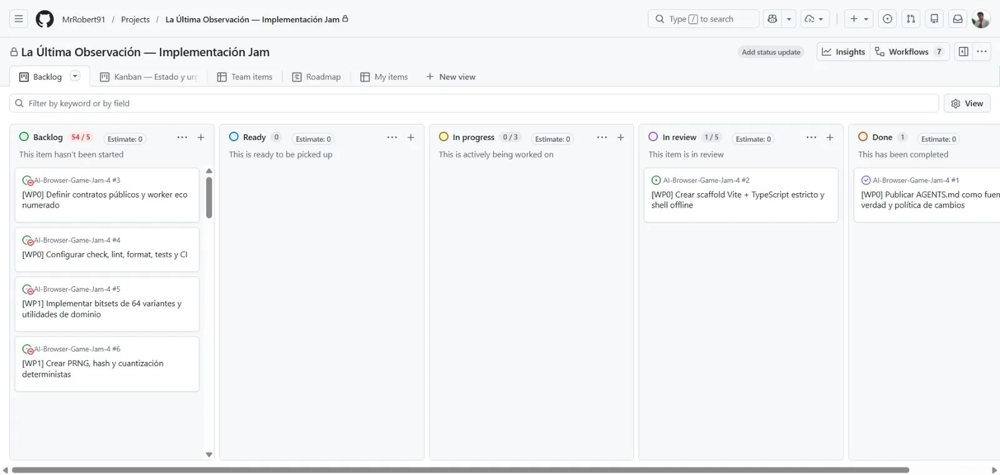

# Evidencias — Issue #2

Scaffold Vite + TypeScript estricto y shell offline.

## Estado y comportamiento




[Vídeo WebM de calibración, 30 s y 720p](./shell-calibration.webm)





La prueba desplegada se ejecutó en
[`https://la-ultima-observacion-web.sliplane.app`](https://la-ultima-observacion-web.sliplane.app):

- servicio Sliplane: `service_qi0aluudq024` en `project_3o4wtis2vnhk`;
- rama/commit: `codex/issue-2-vite-shell` / `da6f3c50a33323b644195ae0644df350ae9d219d`;
- evento terminal: `Service deployed successfully`;
- `/` y `/health`: HTTP 200;
- navegador: calibración confirmada, assets relativos y cero warnings/errores de consola.

La captura de pantalla del preview público agotó dos veces el tiempo de la herramienta después de
pasar la prueba funcional. Se conserva la captura local del mismo artefacto `dist/` y se documenta
la limitación en lugar de presentar una imagen local como si fuera remota.

## Reproducción

```powershell
npm.cmd install
npm.cmd run typecheck
npm.cmd run build
npm.cmd run preview
```

La imagen local se tomó contra `http://127.0.0.1:4173/`. El contenedor remoto usa el `Dockerfile`
de la raíz, Nginx en `8080` y healthcheck `/health`.
