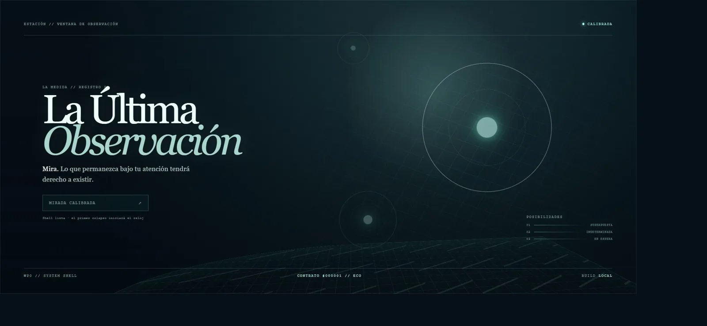

# Evidencia de la issue #3

## Estado inicial

`dev` local y `origin/dev` coincidían en `148a3f8b3751ff27c5b1d6bde829db6bef1eda1b`.
La issue #2 ya estaba cerrada y en **Done**; #3 aparecía desbloqueada en **Backlog**.

## Contrato local

La build estática carga el worker como un bundle local separado y muestra el eco del primer tick
numerado. La calibración existente sigue funcionando y no inicia el reloj.

- Estado visible: `CONTRATO #000001 // ECO` y `data-contract-state="ready"`.
- Consola: cero warnings o errores en una carga limpia.
- Recursos de producción: JS principal, CSS y worker; los tres pertenecen al mismo origen local.
- Interacción: `Calibrar mirada` cambia a `CALIBRADA`, deshabilita el botón y conserva el eco.
- Vídeo WebM: N/A; el cambio de esta issue es un handshake instantáneo de infraestructura, no un
  flujo visual temporal. La prueba reproducible es la combinación de test, consola y captura.

## Validación automatizada

- `npm run typecheck`: verde.
- `npm run test:contracts`: dos archivos, cuatro tests, todos verdes.
- `npm run build`: verde; worker separado de 1,68 kB.
- `npm audit --omit=dev`: cero vulnerabilidades.
- `git diff --check`: verde.

## Preview y publicación

- Sliplane: `project_3o4wtis2vnhk` / `service_qi0aluudq024`.
- Rama y commit: `codex/issue-3-public-contracts-worker` / `dcc1812ff1ca526c76f002e3b11119aea0176d7c`.
- Evento terminal: `service_event_0sz5q0lycu8l`, `Service deployed successfully`.
- URL: <https://la-ultima-observacion-web.sliplane.app/?rev=dcc1812>.
- HTTP: `/` 200 y `/health` 200 (`ok`).
- Logs: build Vite y typecheck verdes; cero líneas con error/fallo/excepción desde el despliegue.
- Navegador: eco `#000001`, calibración y assets main/CSS/worker del mismo origen; consola limpia.

La query `rev=dcc1812` evita reutilizar el HTML anterior almacenado por el navegador; no cambia el
artefacto servido ni introduce una petición externa.
