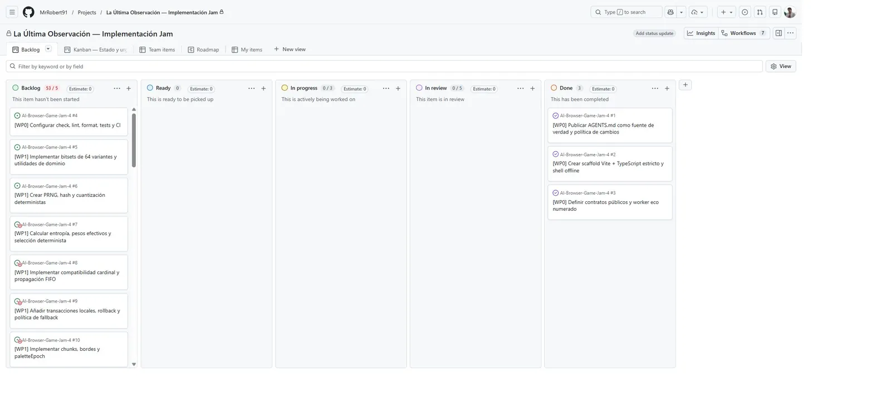
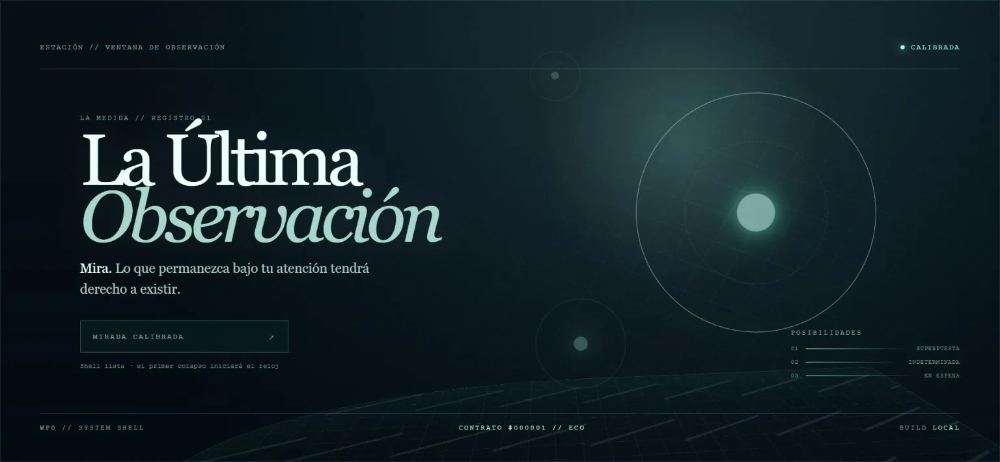
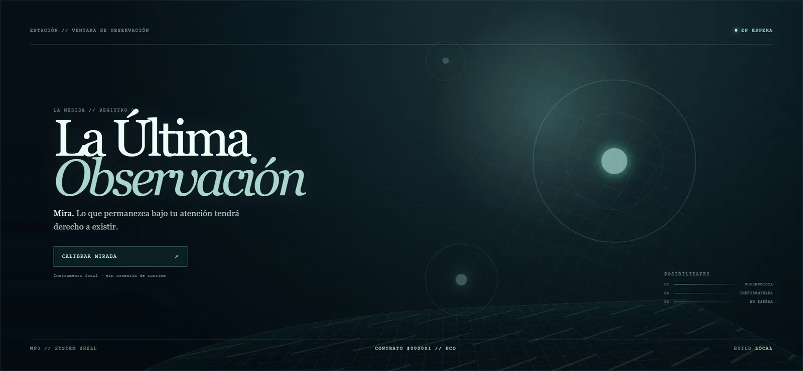

# Evidencia de la issue #4

## Estado inicial

`dev` local y `origin/dev` coincidían en `9de883f12f64644a2a3b596d36372dc55aca32d1`.
Las issues #1–#3 estaban cerradas y en **Done**; #4 era la única issue P0 desbloqueada de WP0 y
aparecía en **Backlog**. No había PRs abiertas ni trabajo activo.

## Puerta de calidad

- Node 24.14.0 queda fijado en `.nvmrc` y GitHub Actions usa ese mismo runtime.
- `npm run check` encadena TypeScript 7.0.2, ESLint 10.8.0 y toda la suite Vitest.
- `npm run format:check` verifica Prettier 3.9.6 sin modificar archivos.
- El workflow instala solo desde `package-lock.json` con `npm ci` y después ejecuta check, formato
  y build en un único job bloqueante.
- TypeScript 6.0.3 se instala en paralelo mediante el alias oficial únicamente para proporcionar
  la API que `typescript-eslint` necesita; el binario `tsc` sigue resolviendo a TypeScript 7.0.2.
- `.gitattributes` normaliza texto a LF para que Windows y CI evalúen el mismo contenido.

## Validación automatizada

- `npm run format:check`: verde.
- `npm run check`: typecheck, lint y dos archivos / cuatro tests, todo verde.
- `npm run build`: verde; worker separado de 1,68 kB.
- `npm ci --ignore-scripts` en un directorio aislado: instalación reproducible sin `--force`.
- `npm audit --omit=dev`: cero vulnerabilidades.
- `git diff --check`: verde.

## Navegador local

La build estática conserva `CONTRATO #000001 // ECO`; `Calibrar mirada` cambia a `CALIBRADA`,
deshabilita el botón y no altera el worker. Los assets JS/CSS pertenecen al mismo origen y la
consola no registra warnings ni errores.

## Sliplane

- Proyecto: `project_3o4wtis2vnhk`.
- Servicio: `service_qi0aluudq024` sobre el servidor existente `server_rlryp6tqmxz6`.
- Rama y commit: `codex/issue-4-quality-gate-ci` / `d412bca2aad8c25e56f91efa7b365d1903a8acea`.
- Evento terminal: `service_event_t1lsbe334b0c`, `Service deployed successfully`.
- El build remoto ejecutó `npm ci` y `npm run build`; TypeScript 7.0.2 y Vite terminaron sin error.
- `/` responde 200 y contiene los hashes JS/CSS esperados; `/health` responde 200 con `ok`.
- URL verificada: <https://la-ultima-observacion-web.sliplane.app/?rev=d412bca>.
- Navegador: eco numerado, calibración y assets del mismo origen; consola limpia.

## Publicación

- PR #60: <https://github.com/MrRobert91/AI-Browser-Game-Jam-4/pull/60>.
- Base/head: `dev` ← `codex/issue-4-quality-gate-ci`.
- Commit de implementación: `d412bca2aad8c25e56f91efa7b365d1903a8acea`.
- Estado inicial de publicación: no draft, `MERGEABLE/CLEAN`, labels `codex` y
  `codex-automation`; checks de la nueva CI pendientes de estado terminal.
- WebM: N/A; el cambio introduce tooling y un gate CI, no un flujo visual temporal nuevo.

Las capturas finales de PR y Project se añaden en esta misma rama después de observar los checks
y mover #4 a **In review**.
