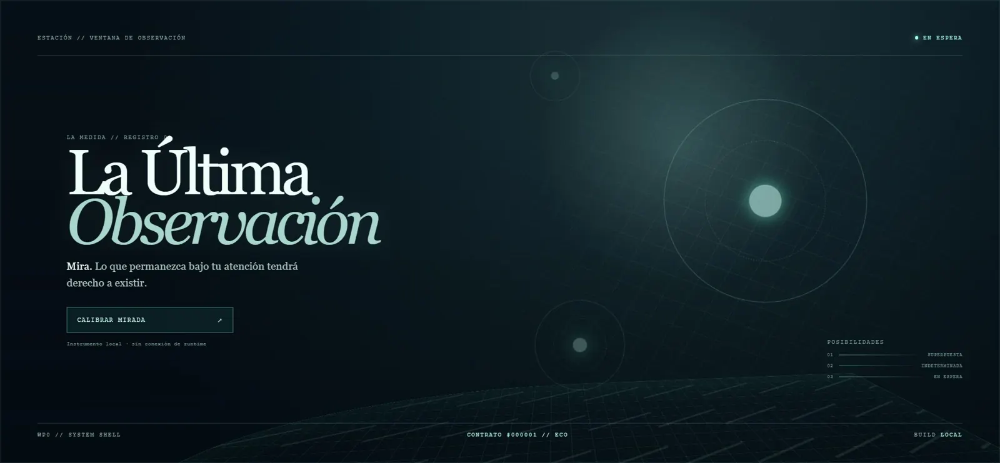

# Issue #5 — Bitsets de 64 variantes

## Trazabilidad

- Base: `dev` = `origin/dev` = `origin/main` en `7be4649ece2a9a8f4bed40ff72653ef6cbf06478`.
- Rama: `codex/issue-5-bitset-domains`.
- Commit de implementación: `f2cbe674fc5b402331cb5e8a3124cb689945abfb`.
- Dependencia cerrada: #3.
- Desbloquea parcialmente: #7; también aporta primitivas para #8–#10.

## Diseño verificable

- `MutableDomainMask` preserva `DomainMask` como contrato de lectura.
- Los constructores de inicialización son las únicas funciones que asignan máscaras.
- Set, clear, assign, intersect y union mutan en sitio.
- `intersectInto` y `unionInto` devuelven un booleano de cambio para las colas de propagación.
- `nextSetBit` usa un cursor numérico sin arrays, `Set` ni generadores.
- Todas las palabras se normalizan a `uint32`, incluidos los bits 31 y 63.

## Validación

- `npm run check` — typecheck, ESLint, 3 archivos y 11 tests.
- `npm run build` — Vite y worker estático.
- `npm audit --omit=dev` — 0 vulnerabilidades.
- `git diff --check`.
- Máscaras completas 0–64 y todos los bits 0–63.
- Bordes explícitos 31, 32 y 63.
- Identidad del objeto estable tras todas las operaciones calientes.

## Sliplane y navegador

- Proyecto `project_3o4wtis2vnhk`; servicio `service_qi0aluudq024`.
- Rama `codex/issue-5-bitset-domains`.
- Commit desplegado `f2cbe674fc5b402331cb5e8a3124cb689945abfb`.
- Evento `service_event_0p9k5b3x5bmu`: `Service deployed successfully`.
- `https://la-ultima-observacion-web.sliplane.app/?rev=f2cbe67` y `/health`: HTTP 200.
- Build local y remoto: calibración, eco `#000001` y consola limpia.

## Evidencia visual

WebM es N/A: la implementación es una primitiva pura del solver y no añade un flujo visual temporal.

## Reversión

Revertir los commits de #5 y apuntar el preview de nuevo a `dev`. No existen datos, migraciones, assets ni decisiones normativas que restaurar.
