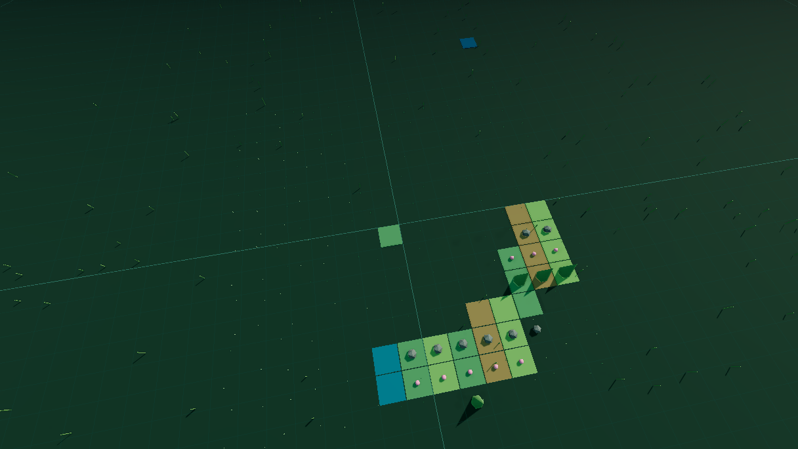

# Issue #52 — Panorama PNG y galería local

El expediente final aparece sin esperar a la captura. En el siguiente microtask, después del render final, el canvas WebGL produce un PNG descargable con nombre basado en la seed.

La misma imagen puede persistirse en IndexedDB junto con seed, perfil, haiku, fecha y dimensiones. La galería conserva como máximo cinco entradas de hasta 5 MiB cada una, elimina primero la más antigua y permite descargar o borrar cada registro. Nada sale del navegador.

## Verificación

- Vitest cubre PNG/metadata y retención de seeds distintas.
- Playwright completa el final, espera la captura no bloqueante, confirma persistencia local, descarga el PNG y abre la galería.
- Captura real: PNG 1216×68, 228.167 bytes, revisado visualmente; no es una recreación.
