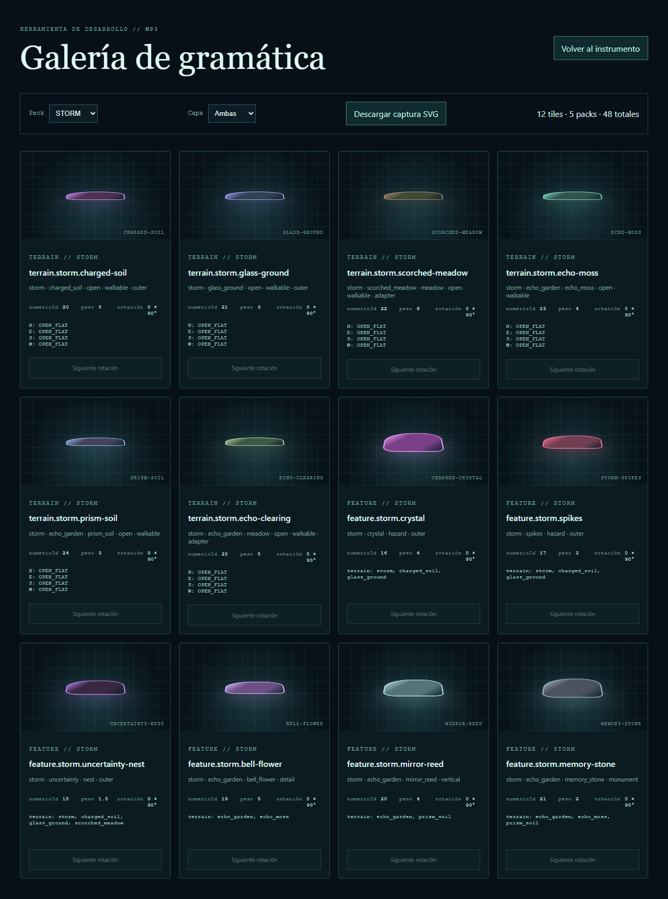

# Issue #55 — Jardín de Eco

La propuesta aprobada extiende Tormenta con seis definiciones de zona exterior. Se reutiliza el unlock de la cuarta Semilla para no alterar el plan macro; el `ChunkStore` congela paleta y packs al inicializar, así que el contenido solo afecta chunks futuros.

## Gate ejecutado

- `validate:tiles`: reciprocidad, dos salidas, adaptadores, IDs y 43/22 variantes.
- `validate:assets`: seis footprints y pivotes válidos, todos con LOD.
- Vitest: contenido, presupuesto menor de 10 KiB y no reescritura de chunks previos.
- Playwright: filtro Storm con 12 cards y ambos extremos de Jardín de Eco.
- `test:sim:release`: 10.000 seeds, 0 vacíos, 0 commits fuera de radio, 0 divergencias, 0 fallbacks y 0 anclas inaccesibles.

Diseño y procedencia: [`docs/content/ECHO_GARDEN.md`](../../content/ECHO_GARDEN.md) y [`ASSET_PROVENANCE.json`](../../release/ASSET_PROVENANCE.json).
