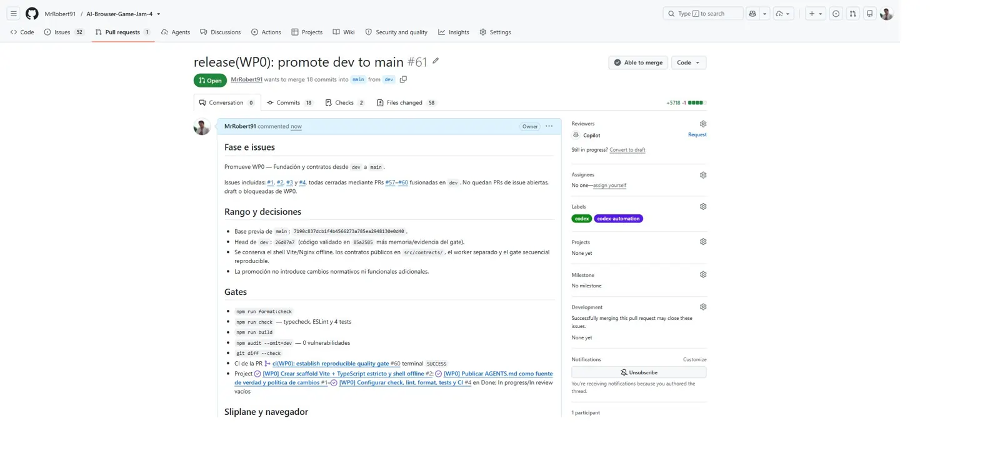

# Promoción WP0 — Fundación y contratos

Evidencia reproducible del gate de fase ejecutado el 5 de agosto de 2026.

## Alcance

- Issues: #1, #2, #3 y #4.
- Integración validada: `dev` en `85a25857134d34fe0bea1d9f4e0c88def4c750f0` antes del commit documental de promoción.
- Base previa: `main` en `7190c837dcb1f4b4566273a785ea2948130e0d40`.
- Preview: `https://la-ultima-observacion-web.sliplane.app/?rev=85a2585`.

## Gates

- `npm run format:check`
- `npm run check` — typecheck, ESLint y 4 tests
- `npm run build`
- `npm audit --omit=dev` — 0 vulnerabilidades
- `git diff --check`
- Sliplane `service_event_vqczlcrtcptd` — `Service deployed successfully`
- `/` y `/health` — HTTP 200
- Navegador — shell y worker eco visibles; consola sin warnings/errores
- Project #2 — #1–#4 en Done; In progress e In review vacíos

## Evidencia visual

PR #61 se verificó no draft, `MERGEABLE/CLEAN`, con labels `codex`/`codex-automation` y CI terminal `SUCCESS`. La evidencia post-merge y los SHAs finales se registrarán en la memoria acumulativa de la siguiente rama autorizada, porque el propio merge commit no puede formar parte de su contenido previo.

WebM es N/A: la promoción verifica un gate y no introduce un flujo temporal nuevo.
