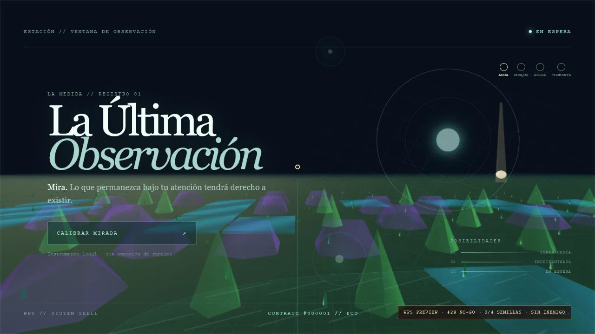
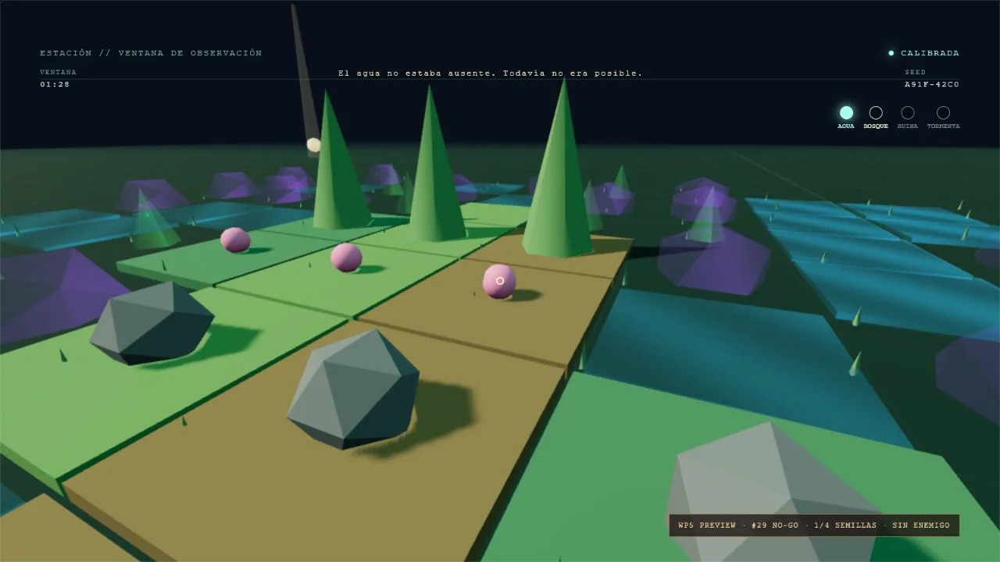
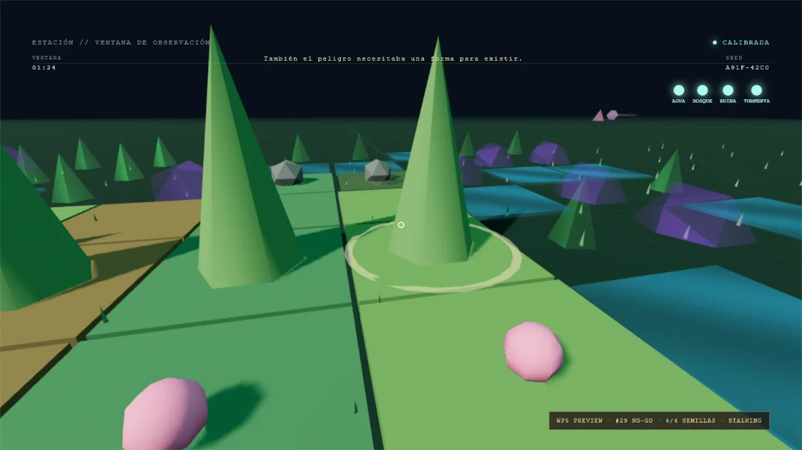
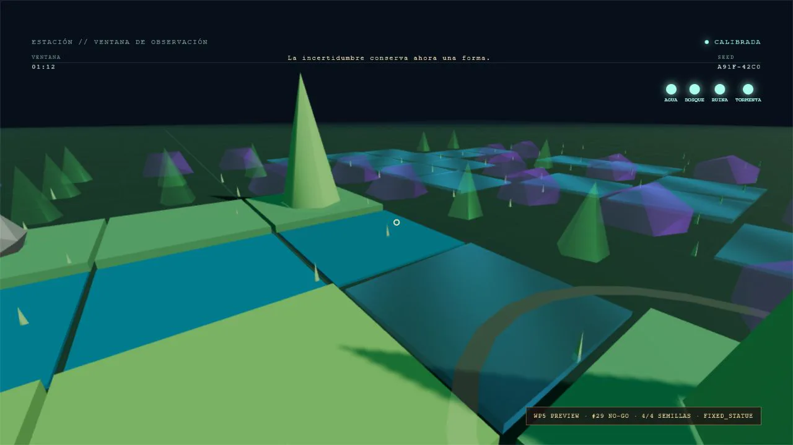

# WP5 — Progresión y peligros en preview controlado

Evidencia producida el 2026-08-05 sobre el build de producción local de la rama
`codex/wp4-observable-world-vertical-slice`, a 1280×720 y con la seed canónica
`A91F-42C0`.

## Alcance verificado

- `01-seed-plan.webp`: las cuatro Semillas aparecen sobre el plan macro
  determinista, mientras el HUD conserva el orden Agua → Bosque → Ruina →
  Tormenta.
- `02-progression.webp`: Agua recogida, Bosque disponible y los demás packs aún
  bloqueados; La Medida reproduce la línea canónica.
- `03-hazards-enemy.webp`: cuatro packs recogidos, peligros estáticos activos y
  La Incertidumbre en estado `STALKING`.
- `04-respawn.webp`: estado posterior al respawn con las cuatro Semillas
  conservadas y La Incertidumbre convertida en `FIXED_STATUE`.
- `wp5-gameplay-preview.webm`: montaje VP9 de 17 s con los cuatro hitos.

La inspección del navegador no registró errores ni warnings. `ffprobe` verificó
el vídeo a 1280×720, 30 fps, 17 s y 290160 bytes.

## Reproducción y límite del gate

```powershell
npm.cmd run build
npm.cmd run preview -- --host 127.0.0.1 --port 4173
```

Abrir:

```text
http://127.0.0.1:4173/?wp5=preview&replay=wp5&evidence=1&speed=1
```

WP5 está desactivada por defecto y solo se monta con `wp5=preview`. El propio
HUD muestra `#29 NO-GO`: estas capturas demuestran la implementación técnica de
#30–#35, pero no sustituyen ninguna de las cinco sesiones humanas exigidas por
#29 ni autorizan promover el preview al recorrido normal.









[Ver vídeo del preview WP5 (WebM, 17 s)](./wp5-gameplay-preview.webm)
