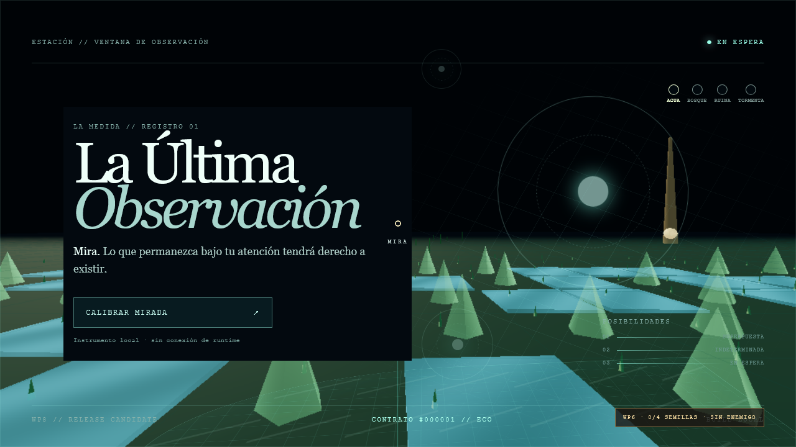
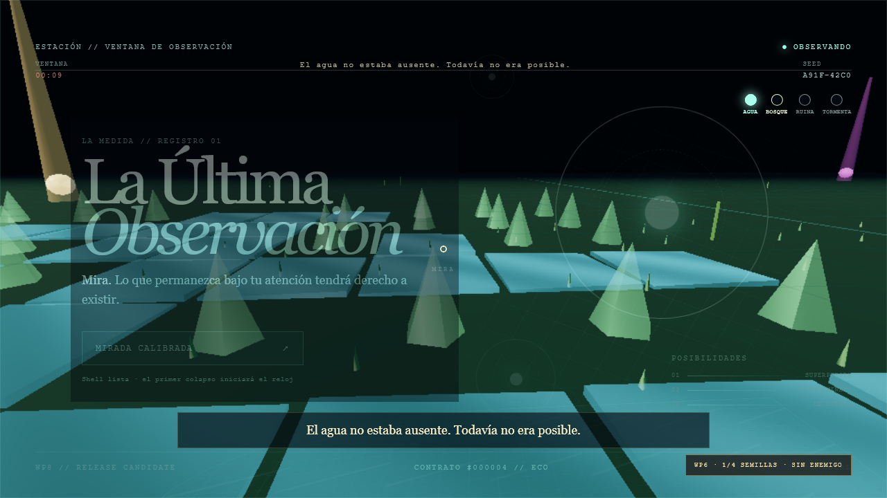
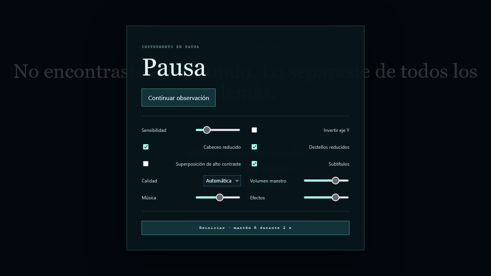

# WP7 + WP8 — cierre, verificación y release candidate

Entrega acumulativa de las issues #40–#51 en `codex/wp7-wp8-release`, creada desde `origin/dev` `e14d782` después de integrar WP6 y publicada como [PR #70](https://github.com/MrRobert91/AI-Browser-Game-Jam-4/pull/70) contra `dev`.

## Alcance verificado

- WP7 (#40–#43): reloj estándar de diez minutos que empieza en el primer colapso, pausa por menú/pestaña/Semilla, bloqueo de commits al llegar a cero, ascenso de ocho segundos, retrato de atención con cinco perfiles, haiku local determinista, copia y reinicio limpio.
- WP8 (#44–#46): fixtures rojos de invariantes, integración de pestaña oculta/final, replay headless a 10 Hz, seed browser, overlay F2/F3/F4 solo en desarrollo y campaña determinista de 10.000 seeds.
- WP8 (#47–#49): recorrido E2E offline, comparación visual Firefox, Chrome estable 1920×1080, perfil de presupuestos y fixtures de ritmo 9:30–11:00.
- WP8 (#50–#51): build estática sin red, créditos y procedencia, texto de itch.io, ZIP reproducible, manifest SHA-256 y checklist final.

## Evidencia visual

- [`01-start.png`](./01-start.png): instrucciones antes de iniciar el reloj.
- [`02-collapse.png`](./02-collapse.png): primer colapso y activación de audio tras gesto.
- [`03-water.png`](./03-water.png): Agua recogida y vocabulario futuro desbloqueado.
- [`04-enemy.png`](./04-enemy.png): peligro e Incertidumbre durante el recorrido.
- [`05-final.png`](./05-final.png): perfil cualitativo, haiku y seed al terminar.
- [`video.webm`](./video.webm): recorrido temporal completo desde calibración hasta resultados.

[Ver recorrido E2E completo (WebM)](./video.webm)

## Resultados reproducibles

- `npm run check`: 40 archivos, 159 tests; typecheck y lint verdes.
- `npm run test:sim:release`: 10.000 seeds, cinco rutas, 100 replays WFC completos × 600 ticks; 0 dominios vacíos, 0 commits fuera de 10,01 m, 0 hashes divergentes, fallback 0 %, `quantum_void_debug = 0` y 0 Semillas inaccesibles.
- `npm run test:e2e`: Chromium 1440×900 y Firefox 1280×720; cuatro casos verdes, sin errores de consola ni requests fallidas. Firefox compara el panel final con tolerancia `maxDiffPixelRatio = 0.035`.
- `npm run test:e2e:desktop`: Chrome estable 1920×1080; dos casos verdes. La primera ejecución descubrió dos 404 de favicon; se añadió `public/favicon.svg` y la repetición quedó limpia.
- `npm run profile:release`: worker p95 2,88 ms, main p95 9,32 ms, 60 FPS estimados, 148 draw calls, 882.000 triángulos, 228 MB de texturas, 8,62 MB en `dist` y 3,1 s hasta interacción; todos los objetivos se cumplen en el harness determinista.
- `npm run package:release`: `release/la-ultima-observacion-rc.zip`, 2.653.429 bytes, SHA-256 `f21400ed03f1286c1dc7bf0e1e6e350ac5a4b36333aa76292bffeff2770b6d79`.

Edge no estaba instalado en el equipo de validación y queda marcado como no disponible, no como aprobado. La medición de GPU integrada requiere hardware manual externo; las métricas automáticas del perfil son un gate reproducible, no una captura física del driver.
